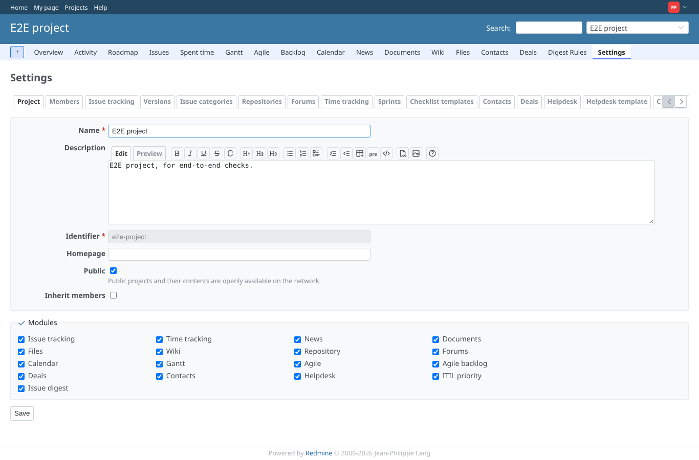

# project-settings-tab

Run 2026-10-07T16:25:15.684Z against http://127.0.0.1:3000.

| screenshot | user | URL | shows |
|---|---|---|---|
|  | admin | `/projects/e2e-project/settings` | Project settings as admin: tabs  |
|  | manager | `/projects/e2e-project/settings` | Project settings as manager: tabs  |
|  | editor | `/projects/e2e-project/settings` | Project settings as a member without the permission: tabs info, members, issues, versions, categories, repositories, boards, activities, agile_sprints, checklist_template, contacts, deals, helpdesk, helpdesk_template, helpdesk_canned_responses, custom_workflows, itil_priority, digest_rules |
|  | editor | `/projects/e2e-project/custom_field_configuration` | The configuration URL is refused without the permission |
|  | outsider | `/projects/e2e-project/settings` | Project settings refused to a non-member |
|  | outsider | `/projects/e2e-project/custom_field_configuration` | The configuration URL refused to a non-member |

## Problems

- /projects/e2e-project/settings as admin: HTTP 500, expected 200
- admin: core tab "info" missing ()
- admin: custom field configuration tab missing ()
- /projects/e2e-project/settings as manager: HTTP 500, expected 200
- manager: core tab "info" missing ()
- manager: custom field configuration tab missing ()
- manager: no E2E colour link to open
