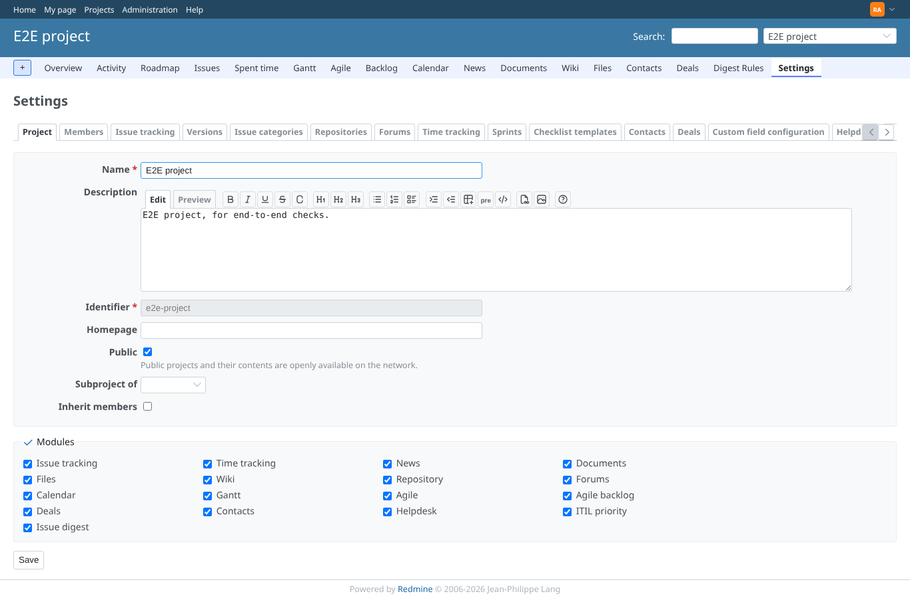
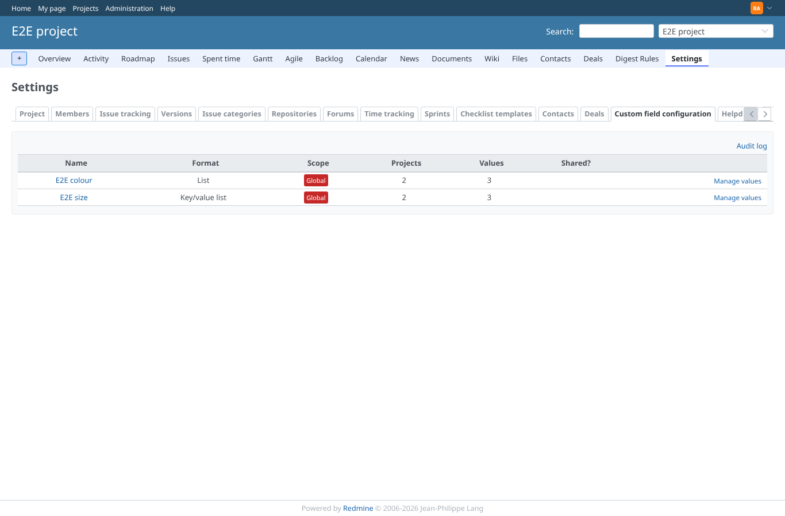
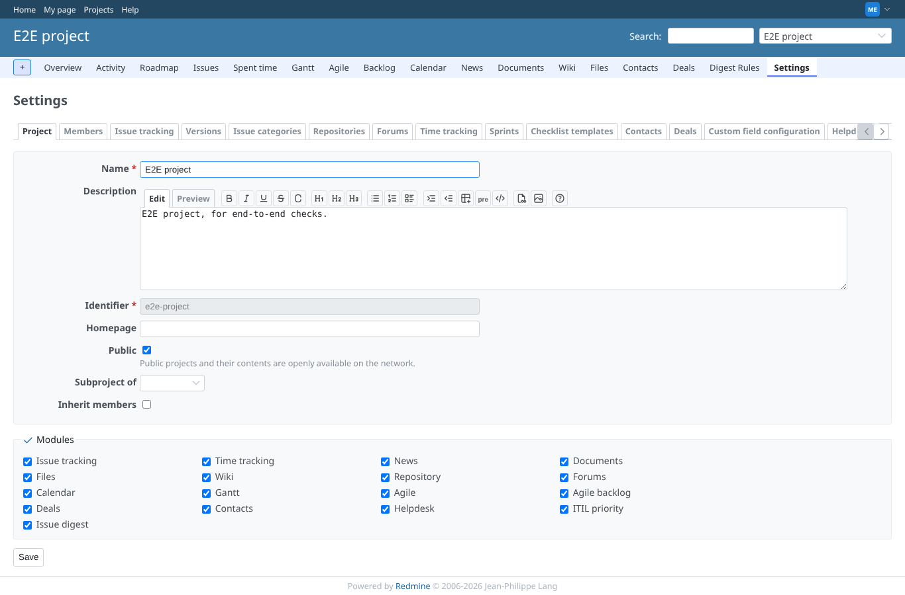
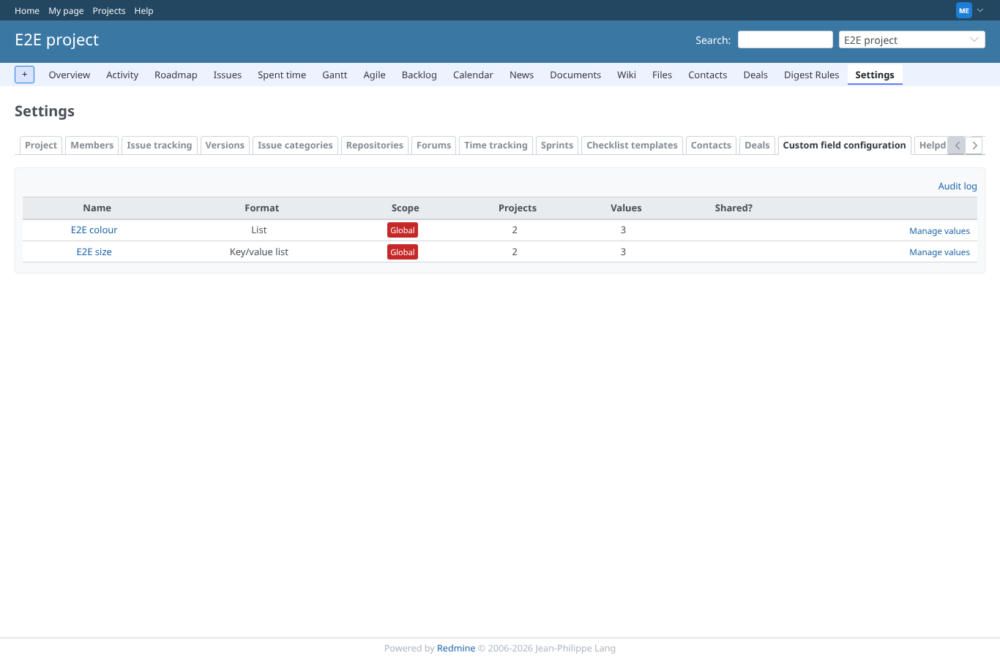
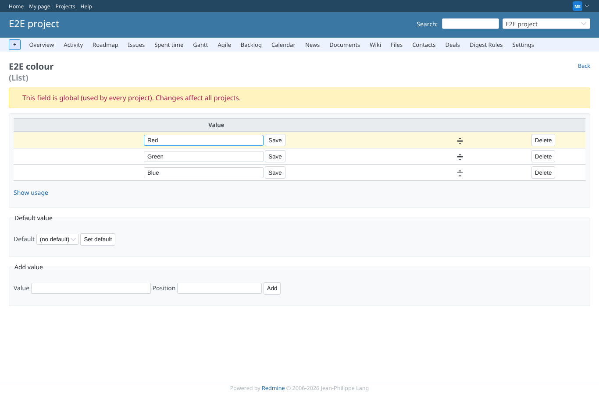
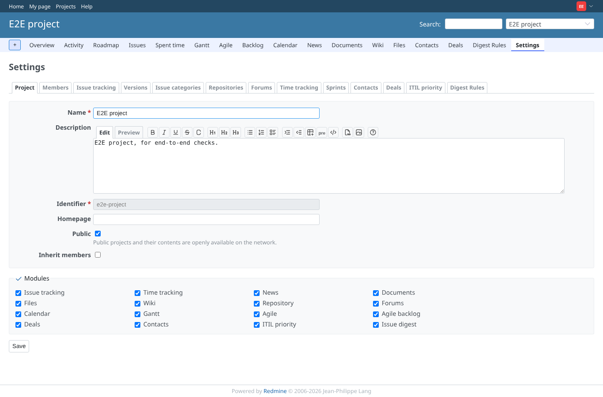
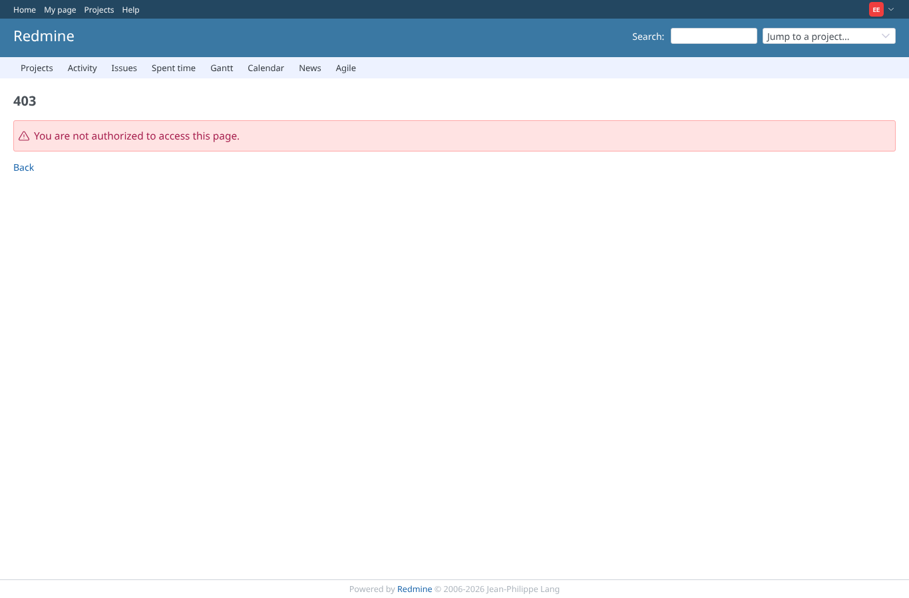

# project-settings-tab

Run 2026-10-07T16:26:40.554Z against http://127.0.0.1:3000.

| screenshot | user | URL | shows |
|---|---|---|---|
|  | admin | `/projects/e2e-project/settings` | Project settings as admin: tabs info, members, issues, versions, categories, repositories, boards, activities, agile_sprints, checklist_template, contacts, deals, custom_field_configuration, helpdesk, helpdesk_template, helpdesk_canned_responses, custom_workflows, itil_priority, digest_rules |
|  | admin | `/projects/e2e-project/settings/custom_field_configuration` | The custom field configuration tab as admin, with the seeded fields |
|  | manager | `/projects/e2e-project/settings` | Project settings as manager: tabs info, members, issues, versions, categories, repositories, boards, activities, agile_sprints, checklist_template, contacts, deals, custom_field_configuration, helpdesk, helpdesk_template, helpdesk_canned_responses, custom_workflows, itil_priority, digest_rules |
|  | manager | `/projects/e2e-project/settings/custom_field_configuration` | The custom field configuration tab as manager, with the seeded fields |
|  | manager | `/projects/e2e-project/custom_field_configuration/fields/1` | A list field opened from the tab, as manager |
|  | editor | `/projects/e2e-project/settings` | Project settings as a member without the permission: tabs info, members, issues, versions, categories, repositories, boards, activities, agile_sprints, checklist_template, contacts, deals, helpdesk, helpdesk_template, helpdesk_canned_responses, custom_workflows, itil_priority, digest_rules |
|  | editor | `/projects/e2e-project/custom_field_configuration` | The configuration URL is refused without the permission |
|  | outsider | `/projects/e2e-project/settings` | Project settings refused to a non-member |
|  | outsider | `/projects/e2e-project/custom_field_configuration` | The configuration URL refused to a non-member |
