# smoke

Run 2026-10-07T16:12:09.329Z against http://127.0.0.1:3000.

| screenshot | user | URL | shows |
|---|---|---|---|
|  | admin | `/` | / (HTTP 200) |
| 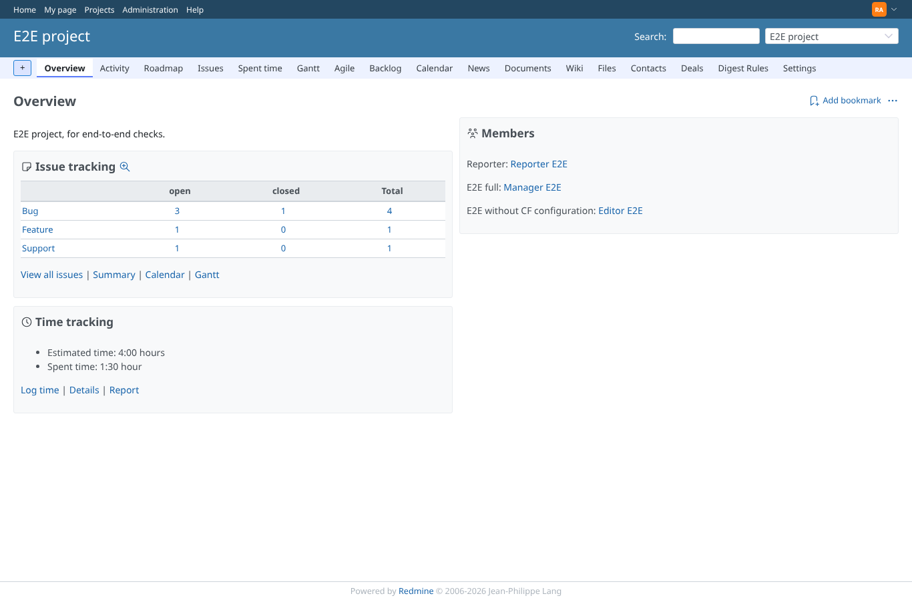 | admin | `/projects/e2e-project` | /projects/e2e-project (HTTP 200) |
| 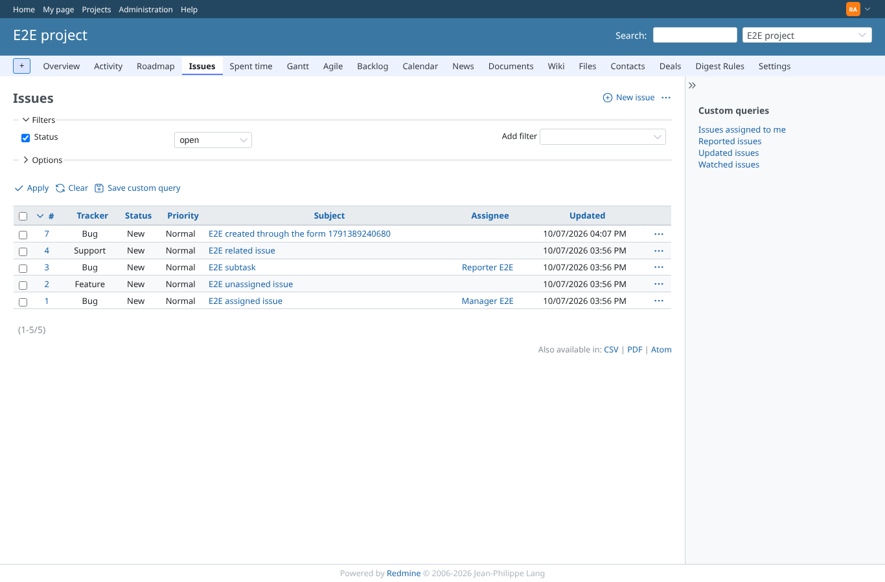 | admin | `/projects/e2e-project/issues` | /projects/e2e-project/issues (HTTP 200) |
| 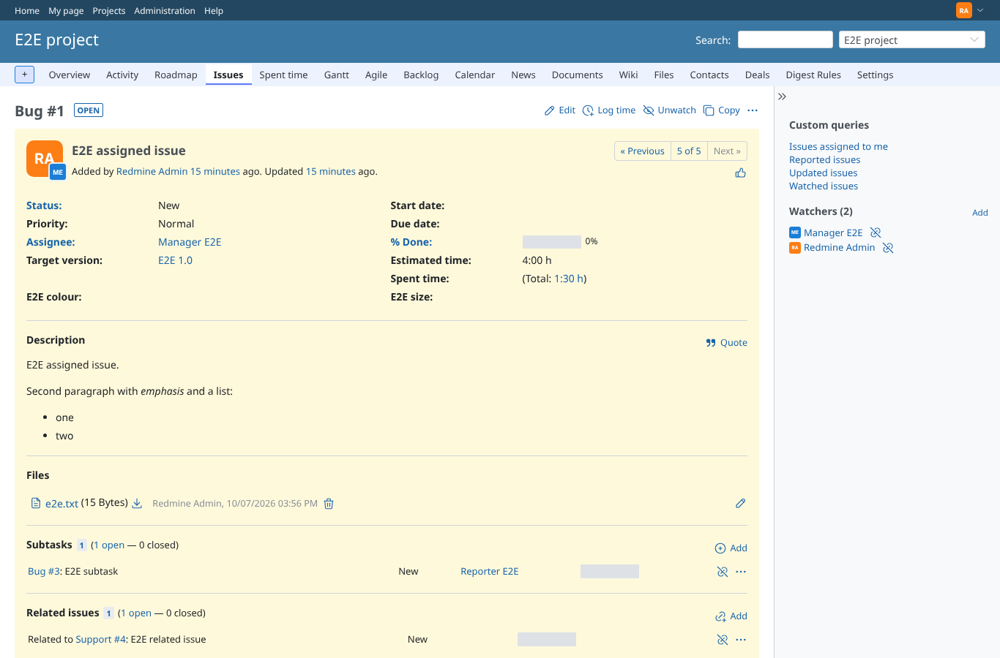 | admin | `/issues/1` | /issues/1 (HTTP 200) |
| 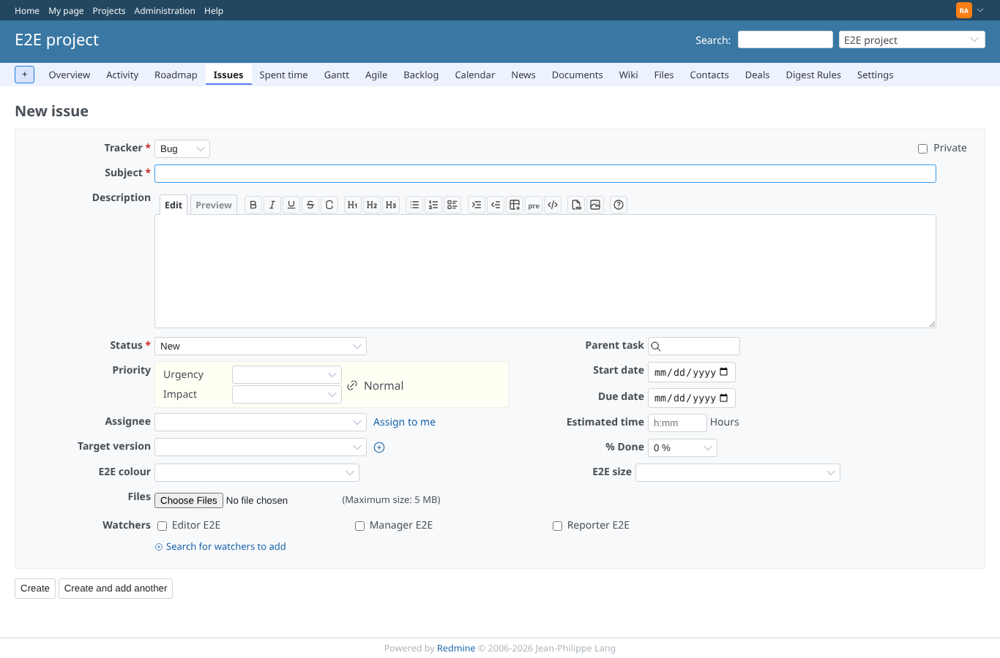 | admin | `/projects/e2e-project/issues/new` | /projects/e2e-project/issues/new (HTTP 200) |
| 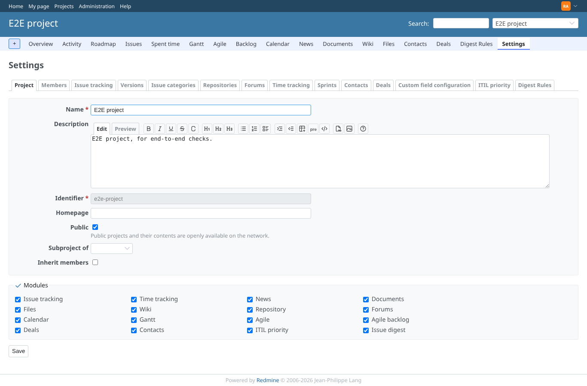 | admin | `/projects/e2e-project/settings` | /projects/e2e-project/settings (HTTP 200) |
| 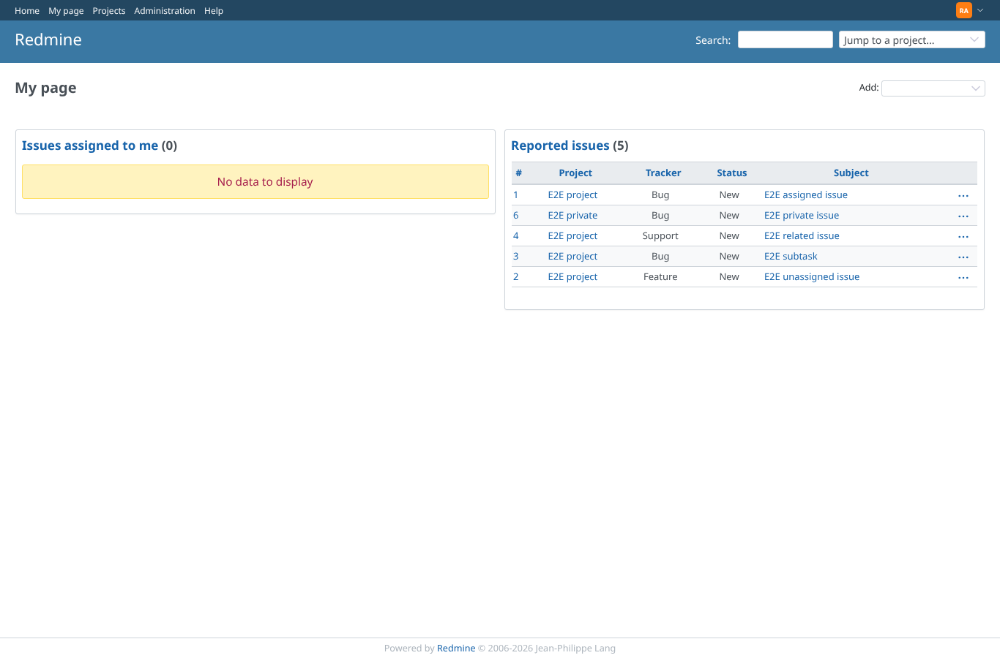 | admin | `/my/page` | /my/page (HTTP 200) |
| 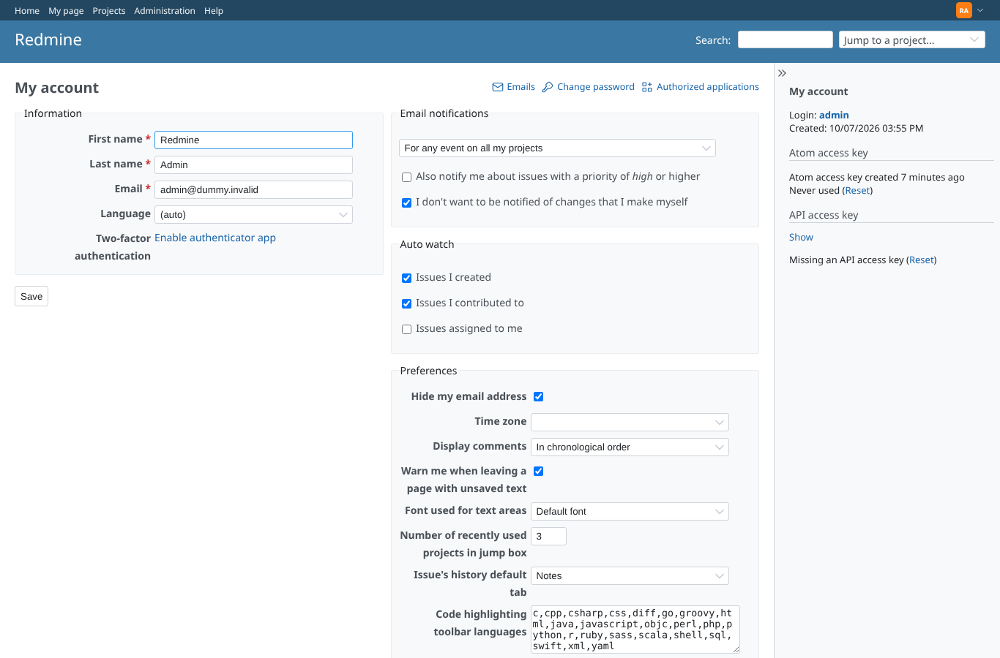 | admin | `/my/account` | /my/account (HTTP 200) |
| 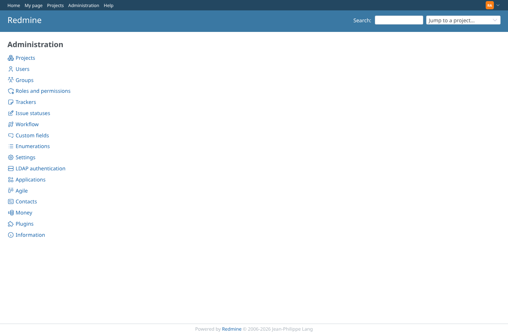 | admin | `/admin` | /admin (HTTP 200) |
| 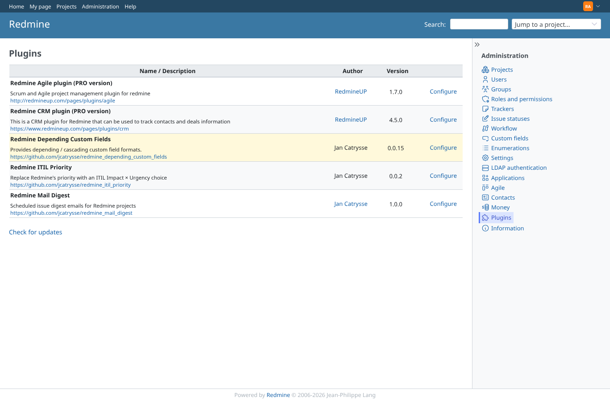 | admin | `/admin/plugins` | /admin/plugins (HTTP 200) |
| 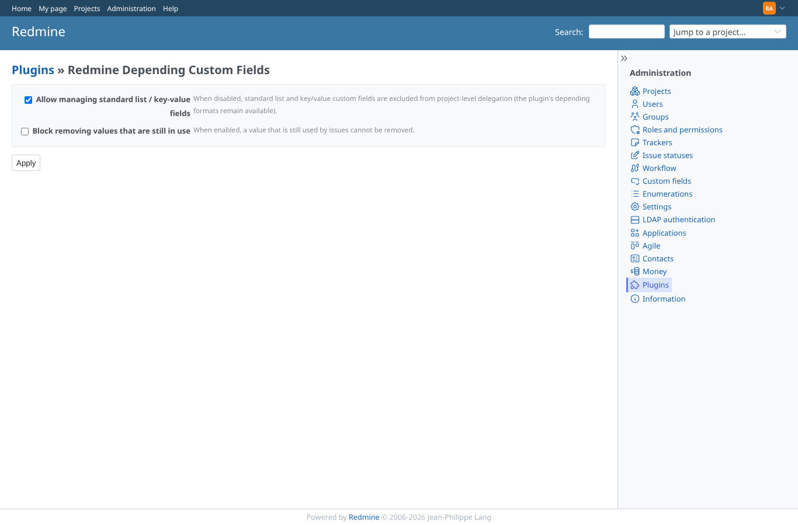 | admin | `/settings/plugin/redmine_depending_custom_fields` | /settings/plugin/redmine_depending_custom_fields (HTTP 200) |
|  | admin | `/depending_custom_fields` | /depending_custom_fields (HTTP 401) |
|  | admin | `/depending_custom_fields/1` | /depending_custom_fields/1 (HTTP 401) |
|  | admin | `/depending_custom_fields/options` | /depending_custom_fields/options (HTTP 401) |
| 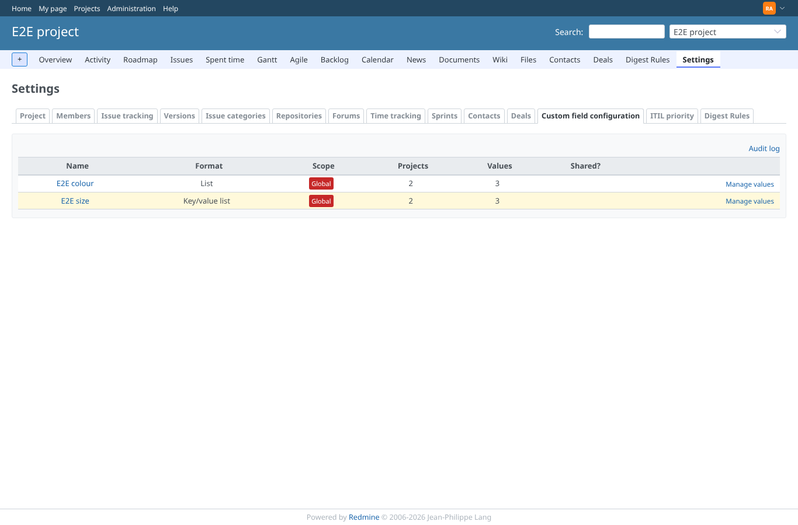 | admin | `/projects/e2e-project/settings/custom_field_configuration` | /projects/e2e-project/custom_field_configuration (HTTP 200) |
| 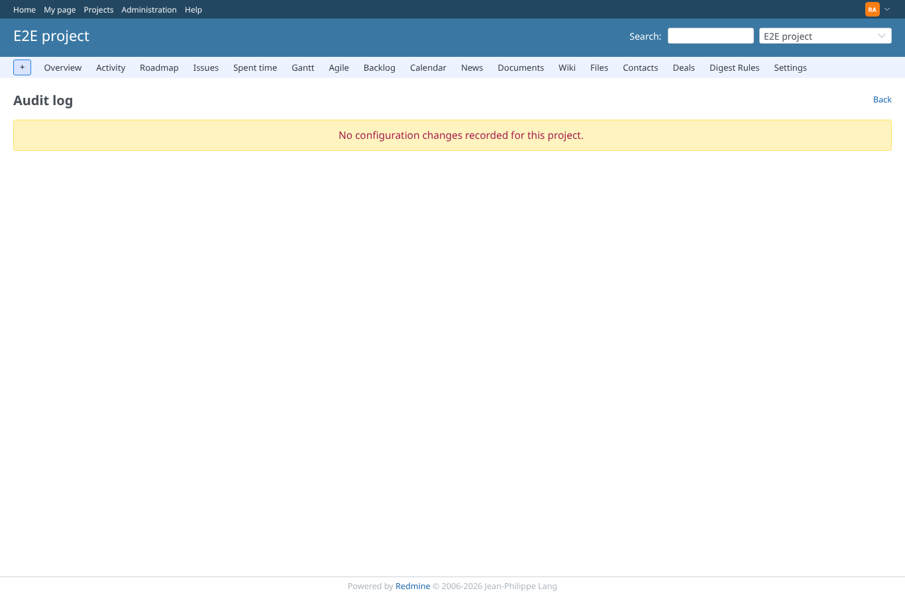 | admin | `/projects/e2e-project/custom_field_configuration/audit` | /projects/e2e-project/custom_field_configuration/audit (HTTP 200) |
| 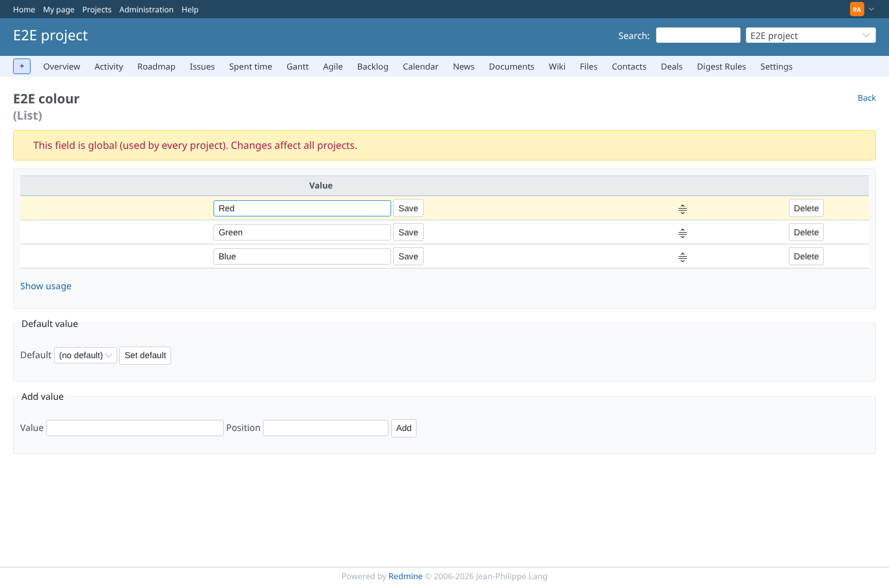 | admin | `/projects/e2e-project/custom_field_configuration/fields/1` | /projects/e2e-project/custom_field_configuration/fields/1 (HTTP 200) |
| 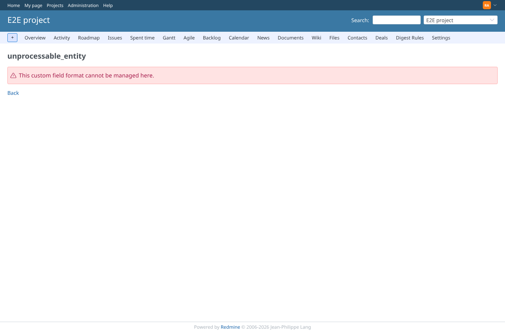 | admin | `/projects/e2e-project/custom_field_configuration/fields/1/dependencies` | /projects/e2e-project/custom_field_configuration/fields/1/dependencies (HTTP 422) |
| 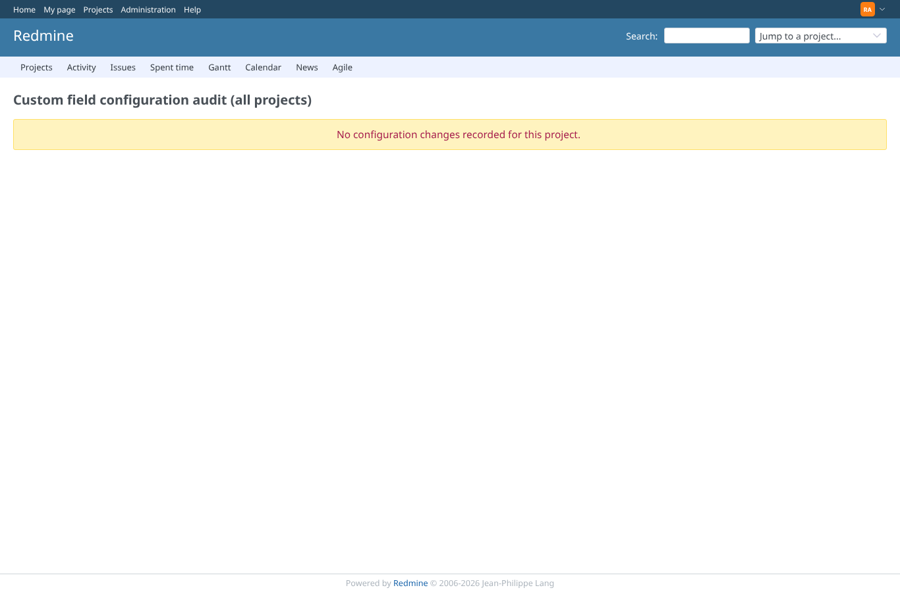 | admin | `/dcf_config_audit` | /dcf_config_audit (HTTP 200) |
