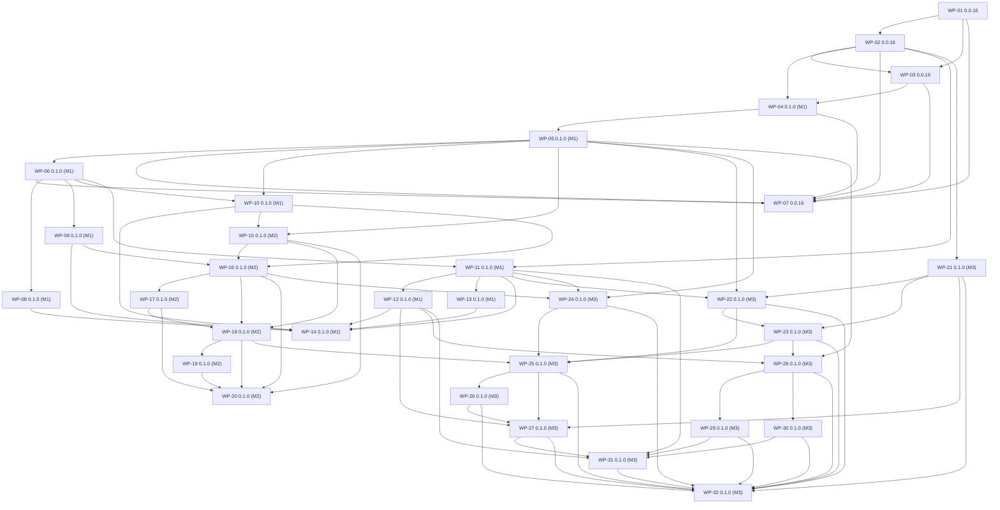

# Large lists: work packages
> Status: plan (spec only, no production code). Spec set: large_lists (see large_lists_README.md).
> Points: 1 to 9. Owner area: delivery. Work packages: WP-01 to WP-32. Decisions: UD-01 to UD-34.

## Purpose

This document cuts the plan into 32 small, reversible work packages (one pull request each), grouped into two releases: the patch release 0.0.16 and the single feature release 0.1.0 with milestones M1, M2 and M3 (UD-01). Every work package must leave the plugin specs green on Redmine 5.1, 6.0, 6.1 and 7.0 and must pass the gates of [`large_lists_quality_protocol.md`](large_lists_quality_protocol.md) before merge. The detailed designs live in the area documents; this document says what goes into which pull request, in which order, and how each one is accepted and rolled back.

## Contents

1. Overview
2. Dependency graph
3. Releases and CHANGELOG lines
4. Work packages
5. Consolidation amendments

## 1. Overview

| WP | Release | Size | Points | Depends on | Title |
|---|---|---|---|---|---|
| WP-01 | 0.0.16 | M | - | - | Local and CI tooling: .codex scripts, RuboCop ratchet, JS toolchain, manual workflows |
| WP-02 | 0.0.16 | M | - | WP-01 | Test hygiene, shared test infrastructure and repository cleanup |
| WP-03 | 0.0.16 | S | 1, 2 | WP-01, WP-02 | Hotfixes in the legacy code: MemCacheStore save crash and bulk-edit data loss |
| WP-04 | 0.1.0 (M1) | M | 1, 2, 3, 5, 6, 7, 9 | WP-02, WP-03 | Characterization specs (Ruby and jsdom) and DB-backed validation specs |
| WP-05 | 0.1.0 (M1) | M | 6, 5 | WP-04 | Central rules module DependencyRules and the single topology helper FieldIndex |
| WP-06 | 0.1.0 (M1) | M | 6 | WP-05 | Shared DependingFormatMethods module for both depending formats; dead code removed |
| WP-07 | 0.0.16 | S | - | WP-01, WP-02, WP-03 | Release 0.0.16 |
| WP-08 | 0.1.0 (M1) | S | 6 | WP-06 | Key/Value list (depending): edit options without duplicates and a single error |
| WP-09 | 0.1.0 (M1) | M | 2, 6 | WP-06 | D1 per-value leniency and issue copies (server) |
| WP-10 | 0.1.0 (M1) | M | 5 | WP-05, WP-06 | Effective parent, server cycle validation, parent select and cycle warning (point 5 server) |
| WP-11 | 0.1.0 (M1) | M | - | WP-02, WP-06 | MySQL TEXT 64 KB safety: storage size validation with a clear i18n error |
| WP-12 | 0.1.0 (M1) | M | 9 | WP-11 | Service error mapping, flash escaping and the audit value cap |
| WP-13 | 0.1.0 (M1) | M | - | WP-11 | Opt-in rake tasks report_sizes and widen_core_columns, MySQL documentation |
| WP-14 | 0.1.0 (M1) | S | - | WP-08, WP-09, WP-10, WP-11, WP-12, WP-13 | Release 0.1.0 (M1) |
| WP-15 | 0.1.0 (M2) | M | 1 | WP-05, WP-10 | Context menu without cache: selection graph, fail-closed wizard roots, named save route (D4) |
| WP-16 | 0.1.0 (M2) | L | 1, 4 | WP-09, WP-10, WP-15 | Issue-form data contract emitted per field (additive, legacy JS untouched) |
| WP-17 | 0.1.0 (M2) | L | 2, 3, 4, 5 | WP-16 | New issue-form runtime (single UMD file) shipped behind the legacy script |
| WP-18 | 0.1.0 (M2) | L | 1, 2, 3, 4, 5 | WP-15, WP-16, WP-17 | Switch: per-field attributes and meta tag replace the inline script; Rails.cache removed (point 1) |
| WP-19 | 0.1.0 (M2) | M | 2 | WP-18 | Radio blank sentinel and required '(none)' in bulk edit and the wizard |
| WP-20 | 0.1.0 (M2) | S | 1, 2, 3, 4, 5 | WP-15, WP-16, WP-17, WP-18, WP-19 | Release 0.1.0 (M2) |
| WP-21 | 0.1.0 (M3) | M | 7, 9 | WP-02 | DependencyPayload: one strict parser for both entry points |
| WP-22 | 0.1.0 (M3) | M | 7 | WP-05, WP-11, WP-21 | Admin JSON transport: virtual attribute dependencies_json (absent = unchanged, '{}' = clear) |
| WP-23 | 0.1.0 (M3) | M | 7 | WP-21, WP-22 | Editor model (pure JS) and cross-layer payload contract |
| WP-24 | 0.1.0 (M3) | M | 7, 9 | WP-05, WP-11, WP-16 | Values endpoint, compact value wire format, editor presenter and shared partial |
| WP-25 | 0.1.0 (M3) | L | 7 | WP-18, WP-22, WP-23, WP-24 | Admin dependency editor UI replaces the matrix (point 7) |
| WP-26 | 0.1.0 (M3) | L | 8 | WP-25 | CSV import and export of the mapping, add missing child values (point 8) |
| WP-27 | 0.1.0 (M3) | L | 9 | WP-12, WP-21, WP-25, WP-26 | Project dependency page on the shared editor with JSON transport and compact audit delta (point 9) |
| WP-28 | 0.1.0 (M3) | L | 9 | WP-05, WP-12, WP-23 | Project values page: server-side search and pagination (point 9) |
| WP-29 | 0.1.0 (M3) | M | 9 | WP-28 | Sort A-Z / Z-A as an audited service (point 9) |
| WP-30 | 0.1.0 (M3) | M | 9 | WP-28 | Page-scoped batch save for Key/Value list values (point 9) |
| WP-31 | 0.1.0 (M3) | M | 9 | WP-11, WP-12, WP-27, WP-29, WP-30 | Large-list safety on project pages: storage ceiling setting and value length cap |
| WP-32 | 0.1.0 (M3) | S | 7, 8, 9 | WP-21, WP-22, WP-23, WP-24, WP-25, WP-26, WP-27, WP-28, WP-29, WP-30, WP-31 | Release 0.1.0 (M3) |

**Release structure (UD-01, resolved by the owner): two releases.** 0.0.16 is a patch release with WP-01, WP-02, WP-03 and WP-07 (tooling, test hygiene, the two hotfixes). Everything else ships together in one release, 0.1.0, built in three milestones: M1 (WP-04 to WP-06 and WP-08 to WP-14: characterization, rules and format modules, server rules, storage safety), M2 (WP-15 to WP-20: issue-form runtime) and M3 (WP-21 to WP-32: editor, import/export, project pages). WP-14 and WP-20 are milestone checkpoints: full evidence run on one SHA, no version bump, no tag. Every work package stays one small pull request. Wherever a document says '0.1.0 (M1)', '0.1.0 (M2)' or '0.1.0 (M3)', the change ships in release 0.1.0 and lands on the main branch during that milestone.

SD-01 (security, wizard save) is not a work package of this plan. Per UD-03 (resolved) it is its own pull request, merged before 0.0.16 is tagged.

## 2. Dependency graph

## 3. Releases and CHANGELOG lines

### 0.0.16

Patch release (UD-01, UD-02, UD-03 resolved): WP-01 tooling (.codex scripts, RuboCop ratchet, JS toolchain, manual 6.1 and JS workflows), WP-02 test hygiene, shared generator and locale parity, WP-03 hotfixes (MemCacheStore save crash, bulk-edit data loss in the legacy JS), WP-07 release, plus the separate SD-01 security pull request. No other behaviour change.

CHANGELOG:

- Fixed: Saving a depending field no longer fails with an internal error on MemCacheStore or other cache stores without delete_matched.
- Fixed: Bulk edit of issues and time entries no longer clears untouched multi-value dependent fields.
- Fixed: The admin custom field form shows 'Default value' instead of a missing translation.
- Removed: the unused and broken test/spec suite.
- Security: The context-menu wizard writes only fields the user may edit (SD-01, own pull request merged before this tag, UD-03).
- Development: local test scripts in .codex mirroring CI, RuboCop ratchet (Ruby 2.7 syntax gate), JavaScript tests with node --test and jsdom, manual workflows for Redmine 6.1 and JavaScript.
- Upgrade notes: Ruby 2.7 or newer is required. Redmine 5.0 remains declared but is not tested; 5.1, 6.0, 6.1 and 7.0 are tested.

### 0.1.0 (one release, built in milestones M1, M2 and M3)

UD-01 (resolved by the owner): everything after the patch release ships in one release. The milestones below are internal checkpoints (WP-14, WP-20) with a full evidence run each; only WP-32 bumps the version and tags 0.1.0. The CHANGELOG 0.1.0 section is the union of the three milestone lists, grouped by Added, Changed, Fixed, Deprecated, Removed, Security, API and Upgrade notes.

#### Milestone M1: server rules and storage safety (WP-04 to WP-06, WP-08 to WP-14)

Server rules and storage safety: WP-08 enumeration options and single error, WP-09 D1 per-value leniency incl. copies, WP-10 effective parent + cycle validation + parent select + cycle warning, WP-11 MySQL TEXT size validation with usage hint, WP-12 service error mapping + flash escaping + audit cap, WP-13 rake tasks report_sizes/widen_core_columns + README MySQL section (+ optional manual MariaDB workflow), WP-14 release. Storage safety ships here (ahead of the 'large-list safety' slot of the ordering) because the editor transport depends on it and it fixes HTTP 500s and silent truncation today.

CHANGELOG:

- Removed: QueryCustomFieldColumnPatch (it had no effect on any supported Redmine version).
- Added: Choosing the field itself or one of its dependent fields as 'Depends on' is refused (form error, HTTP 422 in the APIs).
- Added: The admin form warns about fields that are part of an existing circular dependency; such fields are treated as independent until the cycle is fixed.
- Added: Size validation against MySQL/MariaDB TEXT limits for List, Key/Value list and both depending formats; nothing is truncated anymore.
- Added: Rake tasks redmine:depending_custom_fields:report_sizes and redmine:depending_custom_fields:widen_core_columns (opt-in, dry run by default, CONFIRM=1 to apply).
- Added: A database storage usage line on the custom field form and project pages at 90 percent of the column limit.
- Changed: Stored values that no longer fit the parent are accepted on save until the parent changes; other values of a multi-value field can still be added or removed. In 0.1.0 (M1) this applies to the REST API, email, bulk edit, the wizard and copies; the issue form keeps such values from 0.1.0 (M2) on.
- Changed: Issue copies (single copy, bulk copy, project copy) keep such values when copied unchanged; project copy no longer skips those issues.
- Changed: The 'Depends on' select no longer offers the field's own dependent fields.
- Changed: Audit before/after values above 16 KB are stored shrunk with payload_truncated, payload_bytes and payload_sha256 of the full value.
- Fixed: Key/Value list (depending): a disallowed new value gives one error instead of two, and the edit form no longer shows the stored value twice.
- Fixed: On MySQL/MariaDB, a value list or dependency mapping that is too large gives a clear validation error (HTTP 422 in the APIs, audited error in project settings) instead of an internal error or silent truncation.
- Fixed: A large mapping save on widened MySQL columns no longer rolls back because its audit row overflowed.
- Fixed: Error messages in project settings no longer interpret HTML in field names.
- API: The response shape is unchanged. New HTTP 422 reasons: circular parent and MySQL oversize.
- Upgrade notes: On MySQL servers running without strict mode, saves that used to be truncated silently are now refused. Core List and Key/Value list fields are checked too. The plugin never alters core tables; widening is an explicit rake task and running Redmine processes keep the old limit until restarted. Run report_sizes once after upgrading: fields reported CORRUPT or SUSPECT were truncated earlier and need their values restored from a backup.

#### Milestone M2: issue-form runtime without inline script (WP-15 to WP-20)

Issue-form runtime without inline script (points 1 to 5): WP-15 context menu without cache, WP-16 per-field data contract (additive), WP-17 new UMD runtime behind the legacy script, WP-18 switch (meta tag + runtime, inline script/globals/Rails.cache/MappingBuilder removed, wizard rework), WP-19 radio sentinel and required '(none)', WP-20 release. Must not be tagged before SD-01 (wizard save security) is merged.

CHANGELOG:

- Changed: Dependent fields are never disabled. Disallowed options are hidden and disabled, and a hint under the field names the parent field.
- Changed: In bulk edit and the context-menu wizard, choosing a parent value keeps '(No change)' available on dependent fields; a per-parent default is preselected with a visible hint; a dependent field is cleared automatically only when the parent is '(none)' or its value allows nothing. Setting the parent back to '(No change)' restores the previous choice.
- Changed: The context-menu wizard opens every field on '(No change)'; saving without choosing changes nothing (it used to write the root field's default).
- Changed: Per-parent defaults are filled in on new records and when the parent changes; they are no longer filled into empty fields of existing records when the form opens.
- Changed: Dependent fields whose parent is read-only on the form or not available for the tracker are filtered by the stored parent value and may be hidden when 'Hide when no valid options' is set.
- Changed: Dependent fields whose parent you cannot see are no longer filtered in the browser and the page no longer contains that parent's mapping; the server still validates them.
- Changed: 'Hide when no valid options' hides the field with its label while the parent offers no options, only on single-record forms, never while a stored non-matching value is shown and never in bulk edit.
- Changed: The context menu hides only dependent fields available for the selected issues and their parents; parents of unavailable fields come back with their full list; fields whose parent was deleted or that are part of a circular configuration show as plain lists.
- Changed: Context-menu responses include dependency data for the wizard fields and can be larger for very big mappings.
- Changed: The change event fires only when a value really changes; listen to the new dcf:updated event for option changes (see README Integration).
- Changed: Fields rendered without Redmine's custom field helpers are no longer filtered in the browser (see README Integration); the server still validates them.
- Changed: Without JavaScript, Key/Value list (depending) fields show all active values; the server still rejects invalid combinations.
- Fixed: Stored values that do not match an unchanged parent stay selected, marked and saved instead of being removed silently on the next save; switching the parent back restores them.
- Fixed: Required radio-style dependent fields can be cleared.
- Fixed: No more browser errors with circular configurations.
- Fixed: The wizard reports server errors and stays open.
- Fixed: The dependency mapping is no longer embedded in every page, including the login page.
- Added: In bulk edit and the wizard, required dependent fields offer '(none)' while the parent selection allows no value.
- Added: Hints are announced to screen readers.
- Deprecated: DependingCustomFields.setup and requestSetup (aliases of DependingCustomFields.init) and CustomFieldVisibility; kept at least throughout 0.1.x, removable no earlier than 0.2.0.
- Removed: window.DependingCustomFieldData, window.ContextMenuWizardConfig, MappingBuilder, ParentMenuBuilder, the after_custom_field_save dispatch, data-depending-* attributes, depending_cf_N ids, the hidden mirror inputs and the data-field-id attribute.
- Upgrade notes: Restart Redmine. If automatic plugin asset mirroring (5.1) or redmine_detect_update (6.x/7.0) is disabled or assets are baked into an image, run rake redmine:plugins:assets (5.1) or rake assets:precompile (6.x/7.0). Reload open browser tabs. The cache key depending_custom_fields/mapping is no longer used; before downgrading to an earlier version on a persistent cache store, run bin/rails runner -e production "Rails.cache.delete('depending_custom_fields/mapping')" once.
- Added: The value you last picked for each parent value comes back when you switch the parent back, also after the form refreshes.

#### Milestone M3: dependency editor, import/export, project pages (WP-21 to WP-32)

Dependency editor, import/export and project pages (points 7, 8, 9): WP-21 payload parser, WP-22 admin JSON transport, WP-23 editor model + payload contract, WP-24 values endpoint + presenter + shared partial, WP-25 admin editor UI, WP-26 CSV import/export + add missing child values, WP-27 project dependency page on the shared editor with compact audit delta, WP-28 values page search/pagination, WP-29 sort A-Z/Z-A, WP-30 page-scoped enumeration batch, WP-31 project storage ceiling and value length cap, WP-32 release.

CHANGELOG:

- Added: A dependency editor replaces the checkbox matrix on the admin custom field form and on the project dependency page: collapsible sections per parent value, search, check or uncheck all shown, filters for values without links, counters, per-parent defaults inside each section and inactive values shown and kept.
- Added: CSV import of links (paste or file, preview with per-line errors, merge or replace, undo) and CSV export from the editor, with optional spreadsheet formula protection; 'Add missing child values' for List (depending) fields on the admin form.
- Added: A save is refused when someone else changed the dependency mapping after the page was opened; the editor then shows the current version and your version (use, keep or export yours).
- Added: Search on the project values page for fields with more than 25 values, and pagination for fields with more than 500 values.
- Added: Sort A-Z / Sort Z-A buttons on the project values page; members with 'Manage project custom field configuration' get the new action automatically.
- Added: Page-scoped save of Key/Value list values on paginated or filtered pages, with a warning before leaving unsaved changes.
- Added: Plugin setting for the maximum stored size of changes made in project settings (default 2,048 KiB).
- Changed: The admin form sends the dependency mapping as one field (custom_field[dependencies_json]) and is submitted as multipart/form-data while the editor is active.
- Changed: Saving the admin form without touching the dependencies leaves the stored mapping unchanged.
- Changed: Changing the parent field in the admin form removes links that do not match the new parent's values.
- Changed: The default value field stays visible until a parent field is chosen.
- Changed: Editor saves store defaults as one value for single-value fields and as a list for multi-value fields and normalize the order; API GET output can change after an editor save. The JSON API itself is unchanged.
- Changed: The dependency editors need JavaScript. Without it the admin form keeps the mapping unchanged and the project page disables Save.
- Changed: Links to values that no longer exist are reported by the editor and removed at the next editor save; project audit rows count them.
- Changed: Project dependency audit rows store a compact summary (counts, samples, SHA-256 of the mapping); sort and reorder audit rows store the SHA-256 of the order. The source and import details are reported by the browser and are informational.
- Changed: Drag-and-drop ordering is offered only for unfiltered lists with at most 500 values; redirects keep the search and the page; 'Show usage' reports exact counts.
- Changed: Values added or renamed in project settings are limited to 255 characters, and project-settings changes cannot grow a field beyond the new storage setting.
- Fixed: Unticking every link clears the mapping; parent values containing [ or ] and mappings with more than about 4,000 links can be saved (admin form and project settings).
- Fixed: Links to inactive Key/Value list entries are kept on admin saves.
- Fixed: Correcting a failed dependency save in project settings and saving again no longer reports a conflict.
- Deprecated: Posting value_dependencies / default_value_dependencies as nested params to the project dependency page; send dependencies_json (accepted throughout 0.1.x, removed no earlier than 0.2.0). The admin safe attributes value_dependencies and default_value_dependencies remain permanently.
- Removed: Partials custom_fields/formats/_dependencies_matrix and _default_dependencies, CSS classes .dependencies-matrix*, .dependencies-defaults* and .dcf-dependencies-matrix, locale key text_dependency_matrix_help.
- Upgrade notes: Links dropped by earlier versions (inactive Key/Value entries) cannot be restored. Links stored under parent values containing [ or ] were saved under corrupted keys by earlier versions; the editor lists them as orphans and they must be re-linked once. Copied Key/Value list (depending) fields keep links to the source field's entries (no remap); they show as orphans and are removed at the first editor save. Reverse proxies may limit request bodies (nginx client_max_body_size is 1 MB by default): raise it for very large mappings. On PostgreSQL and SQLite, changes from project settings are limited by the new storage setting; the administration and the API are not. Restart Redmine after upgrading (new asset files).
- Changed: The project dependency page shows the global/shared field warning, and a notice instead of the editor when the parent field is not available in the project or no longer exists.
- Changed: The admin form asks for confirmation before a format change that would discard unsaved dependency edits, warns before leaving with unsaved edits, and now places the dependency editor after 'Hide when no valid options' and the edit style.

## 4. Work packages

### WP-01: Local and CI tooling: .codex scripts, RuboCop ratchet, JS toolchain, manual workflows

| Release | Size | Points | Depends on |
|---|---|---|---|
| 0.0.16 | M | - | - |

**Scope**

D10 tooling, no runtime change. Add .codex/lib/common.sh, .codex/redmine_clone.sh, .codex/test_setup.sh, .codex/test_plugin.sh (suites rspec, system, js, lint, css; --write-fixtures writes into the repo test/js/fixtures), .codex/test_matrix.sh, .codex/rubocop_ratchet.sh and .codex/lib/rubocop_ratchet.rb, mirroring the CI steps (quality design section 4; prototypes in the planning scratch space: design/qa/plugin/.codex, verified on 5.1, 6.0, 6.1, 7.0, evidence E1). Committed .rubocop.yml overlay inheriting core 7.0 config with TargetRubyVersion 2.7, TargetRailsVersion 6.1 and Rails/HttpStatusNameConsistency disabled (deviation from raw D10 config, UD-29; raw config suggests :unprocessable_content which raises on Rack 2.2). Ratchet = Ruby 2.7 Lint/Syntax on all Ruby files + compat grep on added lines (intersect?, Data.define, params.expect, :unprocessable_content, to_prepare, delete_matched, javascript_tag, en and em dash characters) + per-file per-cop count ratchet against the merge-base. The 7 endless defs in spec/patches/custom_field_required_validation_spec.rb become normal defs (otherwise the syntax gate cannot pass, E6). package.json (private, engines node >=22.13, devDependencies jsdom ~29.1.1, jquery 3.7.1, acorn ~8.18.0 per UD-30; scripts check, test, test:ci), package-lock.json, .gitignore (node_modules, coverage), test/js/support/check_assets.js (ES2017 parse of every assets/javascripts/*.js). Workflows: new rspec-61.yml (upstream redmine/redmine 6.1-stable, Ruby 3.3.9, UD-31) and js-tests.yml (npm ci, check, test:ci, core stylelint on plugin CSS), both workflow_dispatch only; rspec-51/60/70 get permissions: contents: read, a system_specs input (default false), rsync --exclude node_modules/, removal of the unused nodejs apt step; rspec-70 also gets lint (default true) and base_ref inputs with fetch-depth 0.

**Files**

- `.codex/lib/common.sh`
- `.codex/redmine_clone.sh`
- `.codex/test_setup.sh`
- `.codex/test_plugin.sh`
- `.codex/test_matrix.sh`
- `.codex/rubocop_ratchet.sh`
- `.codex/lib/rubocop_ratchet.rb`
- `.rubocop.yml`
- `package.json`
- `package-lock.json`
- `.gitignore`
- `test/js/support/check_assets.js`
- `.github/workflows/rspec-51.yml`
- `.github/workflows/rspec-60.yml`
- `.github/workflows/rspec-70.yml`
- .github/workflows/rspec-61.yml (new)
- .github/workflows/js-tests.yml (new)
- `spec/quality/ci_workflows_spec.rb`
- `spec/quality/rubocop_ratchet_spec.rb`
- `spec/quality/fixtures/*.json`
- spec/patches/custom_field_required_validation_spec.rb (endless defs only)

**Tests**

- spec/quality/ci_workflows_spec.rb: every workflow has exactly workflow_dispatch, declares permissions contents read, negative case with push fails
- spec/quality/rubocop_ratchet_spec.rb: identical base/head passes; extra offense in changed file fails with NEW line; new file must be clean; javascript_tag or en dash on an added line fails compat unless marked dcf-compat-ok
- npm run check: every shipped asset parses as ES2017 (acorn rejects ?. ?? and object spread)
- Manual script checks recorded in the WP report: unsupported version exit 2, unmanaged dir exit 3, missing setup exit 6, DB unreachable exit 5

**Acceptance**

- .codex/test_matrix.sh --setup --suite rspec --suite lint prints version=5.1/6.0/6.1/7.0 exit=0 with equal example counts (259 baseline plus the new quality examples, 0 failures) and 'SYNTAX PASS COMPAT PASS RATCHET PASS'
- npm ci && npm run check && npm test exit 0 on Node 22
- git diff shows no change under app/, lib/, config/, assets/, init.rb and the plugin Gemfile
- Every workflow file still triggers only on workflow_dispatch (spec green)

**Compatibility notes**

Developer-only files. Redmine never loads .codex, package.json or test/js; core RuboCop ignores plugins/** so the overlay only affects the ratchet (E5). Plugin Gemfile untouched because it is eval'd into every Redmine bundle. CI stays manual-only.

**Rollback**

Revert the PR. No runtime or data effect; rspec-61.yml and js-tests.yml disappear from the Actions list.

**Related decisions and defects**: UD-29, UD-30, UD-31, UD-32 (resolved), UD-33, UD-34

**Definition of done**: the per-WP report of [`large_lists_quality_protocol.md`](large_lists_quality_protocol.md) (sections 1 to 9) with observed evidence for every applicable gate.

### WP-02: Test hygiene, shared test infrastructure and repository cleanup

| Release | Size | Points | Depends on |
|---|---|---|---|
| 0.0.16 | M | - | WP-01 |

**Scope**

spec/rails_helper.rb: config.order = :random with Kernel.srand, remove the second init.rb load (verified green on 4 versions, E12), reset I18n.locale after each example, system specs opt-in (DCF_SYSTEM_SPECS=1, spec/support/system_driver.rb with core capybara/selenium headless chrome, dcf_login via a.logout, dcf_selectable_options on DOM state because Selenium reports hidden options as displayed, E9), tag exclusions :mysql (unless Redmine::Database.mysql?) and :perf (unless DCF_PERF_SPECS=1). spec/support/query_counter.rb (dcf_count_queries, dcf_count_yaml_loads on ActiveRecord::Store::IndifferentCoder#load, dcf_plugin_overhead) so every later G6 assertion is invariance or differential only. ONE large-list generator: the arithmetic generator of quality revision 2 (spec/support/dcf_large_list.rb plus JS twin test/js/support/large_list.js, naive left-fold sizes(), tricky values, limits byte helpers element_bytes / yaml_list_bytes / values_of_yaml_bytes), pinned SHA-256 prefixes 233acf899217e962 (names(5570, tricky_every: 97)) and 466b240daca61be9 (partition), verified identical on Ruby 3.2.6, 3.3.6 and Node 22.22.0 (E17). Reconciliation: limits revision 2 proposed the mulberry32 generator (0634a624422f2f06) while quality revision 2 adopted the arithmetic one; the arithmetic one wins (cross-language parity proven, exact YAML byte targets, quality owns the generator). spec/support/dcf_config_helpers.rb: dedicated tracker/status builders and dcf_fixture_record with fixed disjoint id ranges (CustomField 9_100_001+, CustomFieldEnumeration 9_200_001+, Issue 9_300_001+, Project 9_400_001+, User 9_500_001+, Role 9_600_001+, Tracker 9_700_001+, IssueStatus 9_800_001+; E23). spec/quality/locale_parity_spec.rb (flattened keys incl. nested activerecord keys, duplicate mapping keys via Psych.parse_stream walk, same %{} variables, no blanks, reviewed English-leftover allowlist, used keys incl. prefixed symbol literals and dcf_* error symbols, I18N constant maps when they exist, per-locale quote convention, no dashes) and spec/quality/no_dash_spec.rb. Fix the only undefined key: l(:label_default_value) becomes core l(:field_default_value) in app/views/custom_fields/formats/_default_dependencies.html.erb:17. Replace the 14 (README) and 3 (CHANGELOG) en/em dashes; README Development and Compatibility sections (Redmine 5.1 to 7.0 tested, 5.0 declared, Ruby 2.7 or newer). Delete the never-run, broken test/spec/** and test/test_helper.rb. Amend docs/specs/project_custom_field_configuration_test_plan.md section 8 (system specs exist, opt-in).

**Consolidation amendments**

- Locale parity spec iterates RedmineDependingCustomFields::ClientConfig::I18N and DependencyEditorConfig::I18N when they are defined (gap 5). The constant name I18N_KEYS is not used anywhere.
- Parity allowlist (keys intentionally identical to en): de and nl text_dcf_live_message; pre-listed fr label_dcf_inactive, fr label_dcf_import_mode and nl label_dcf_tab_char (gap 10). The full allowlist lives in large_lists_i18n_registry.md.

**Files**

- `spec/rails_helper.rb`
- `spec/support/system_driver.rb`
- `spec/support/query_counter.rb`
- `spec/support/dcf_large_list.rb`
- `test/js/support/large_list.js`
- `test/js/large_list_parity.test.js`
- `spec/quality/dcf_large_list_spec.rb`
- `spec/support/dcf_config_helpers.rb`
- `spec/quality/locale_parity_spec.rb`
- `spec/quality/no_dash_spec.rb`
- `spec/system/smoke_spec.rb`
- `app/views/custom_fields/formats/_default_dependencies.html.erb`
- `README.md`
- `CHANGELOG.md`
- `docs/specs/project_custom_field_configuration_test_plan.md`
- test/spec/** (deleted)
- test/test_helper.rb (deleted)

**Tests**

- spec/quality/dcf_large_list_spec.rb and test/js/large_list_parity.test.js pin both hashes; values_of_yaml_bytes(1_000 / 65_535 / 65_536) exact
- spec/quality/locale_parity_spec.rb green (74 keys each, the label_default_value failure is fixed in the same PR); negative fixture with a duplicated nested key fails
- spec/quality/no_dash_spec.rb green on README.md, CHANGELOG.md and config/locales
- spec/system/smoke_spec.rb (opt-in) logs in and opens an issue form on 5.1 and 7.0
- Request spec: admin custom field edit page of a depending field renders the core 'Default value' label and no 'translation missing'

**Acceptance**

- Standard gate: .codex/test_matrix.sh --setup --suite rspec --suite lint green on 5.1, 6.0, 6.1, 7.0 at one SHA (dirty=0)
- Random order: seeds 1, 4242 and 31337 green on 7.0, seed printed in the log
- DCF_SYSTEM_SPECS=1 .codex/test_plugin.sh 5.1 --suite system and 7.0 --suite system exit 0
- No en or em dash in README.md, CHANGELOG.md, locale files

**Compatibility notes**

Only user-visible change is the corrected 'Default value' header. Removing the duplicate init.rb load removes duplicate callbacks in the test process only. Deleting test/spec has no effect: it was never run by CI or rake.

**Rollback**

Revert the PR; specs return to defined order and the label falls back to the missing translation.

**Related decisions and defects**: none

**Definition of done**: the per-WP report of [`large_lists_quality_protocol.md`](large_lists_quality_protocol.md) (sections 1 to 9) with observed evidence for every applicable gate.

### WP-03: Hotfixes in the legacy code: MemCacheStore save crash and bulk-edit data loss

| Release | Size | Points | Depends on |
|---|---|---|---|
| 0.0.16 | S | 1, 2 | WP-01, WP-02 |

**Scope**

Two surgical fixes ahead of the rewrite (UD-02). (1) Remove Rails.cache.delete_matched('dcf/*') from both formats' after_custom_field_save (depending_list_format.rb:79, depending_enumeration_format.rb:89). No 'dcf/*' key is written anywhere in app/ or lib/ (grep), and delete_matched raises NotImplementedError on MemCacheStore, rolling back every depending save. The plain Rails.cache.delete('depending_custom_fields/mapping') stays until WP-18 removes the cache. (2) In assets/javascripts/depending_custom_fields.js replace '#bulk-edit-form' with '#bulk_edit_form' (lines 101, 201, 298); core uses id bulk_edit_form for both issues (core-7.0 app/views/issues/bulk_edit.html.erb:26) and time entries (core-7.0 app/views/timelog/bulk_edit.html.erb:32, core-5.1 :31). Evidence (planning scratch space, design/delivery/hf_harness.js, hf_harness2.js on the jsdom harness): scenario B (untouched multi child) form data goes from ['[1]=','[2][]='] (clears the field on every issue) to ['[1]='] only; B2 likewise; A1 and U2 lose a duplicated child entry; every other scenario output is identical.

**Files**

- `lib/redmine_depending_custom_fields/depending_list_format.rb`
- `lib/redmine_depending_custom_fields/depending_enumeration_format.rb`
- `assets/javascripts/depending_custom_fields.js`
- `spec/models/custom_field_cache_callback_spec.rb`
- `spec/models/depending_format_cache_spec.rb`
- spec/models/cache_store_independence_spec.rb (new, interim part)
- test/js/legacy_bulk_hotfix.test.js (new)
- spec/system/bulk_edit_untouched_multi_spec.rb (new, opt-in)
- `CHANGELOG.md`

**Tests**

- spec/models/cache_store_independence_spec.rb: with Rails.cache replaced by a store whose delete_matched raises NotImplementedError, creating and updating depending_list and depending_enumeration fields and a project-service save succeed (red on fa0adaf, green after)
- Updated cache callback specs assert delete_matched is never called
- test/js/legacy_bulk_hotfix.test.js: harness scenarios A, A', B, B2, Q, U on bulk_edit_form; B posts no child entry (red on fa0adaf, green after)
- Opt-in system spec on 5.1 and 7.0: bulk edit of 2 issues with an untouched multi-select child keeps both stored values after Submit

**Acceptance**

- Standard gate green on 5.1, 6.0, 6.1, 7.0
- Red-green evidence for both defects quoted in the WP report (failing excerpt on fa0adaf, passing after)
- System spec green on 5.1 and 7.0 with screenshots

**Compatibility notes**

Pure fixes. The legacy bulk branch now runs on core bulk edit pages as it already did in the wizard: '(no change)' handling is unchanged, a required multi child stays disabled but no longer posts an empty array. Cache behaviour otherwise unchanged.

**Rollback**

Revert the PR (two code edits). No data effect; reverting reintroduces both defects.

**Related decisions and defects**: UD-02

**Definition of done**: the per-WP report of [`large_lists_quality_protocol.md`](large_lists_quality_protocol.md) (sections 1 to 9) with observed evidence for every applicable gate.

### WP-04: Characterization specs (Ruby and jsdom) and DB-backed validation specs

| Release | Size | Points | Depends on |
|---|---|---|---|
| 0.1.0 (M1) | M | 1, 2, 3, 5, 6, 7, 9 | WP-02, WP-03 |

**Scope**

Pin current behaviour before any refactor (quality 5.1, server 18.1), committed alone. Delivered: reference commit 36b74c7 (the last of four WP-04 commits; later "spec/characterization unchanged" checks diff against it). The SD-14 security fix flips the options rows of wizard_routes_spec.rb right after it. Ruby, DB-backed under spec/characterization/: possible_values_options for nil, a record and an Array, and for a Project passed to an Issue field (all-hidden 3-tuples today); query_filter_values (list all, enum restricted, nil query raises); value_from_keyword (case folding, ; and , split, comma values not importable in multi, duplicates kept, enum id strings, import ordering with unset parent matches full list); validate_custom_value (list one error, enum double error, unchanged legacy combination rejected, multi add next to legacy rejected, issue copy with legacy rejected, stored cycle validated per mapping); enum possible_custom_value_options duplicate; before_custom_field_save normalisation; ContextMenusControllerPatch on the flat 5.x/6.x and namespaced 7.0 controllers; GET depending_custom_fields/options routed to API#show; admin nested-param save (untick-all ignored, ']' corrupts keys, inactive enumeration links dropped); project update_dependencies with no params clears the mapping; enumeration reorder with 3+ rows. JS: test/js/legacy_characterization.test.js pins harness scenarios A0..U2 on the hotfixed legacy script. Also rewrite spec/patches/custom_field_required_validation_spec.rb and spec/lib/value_validation_spec.rb (moved to spec/models/dependency_validation_spec.rb) DB-backed with real fields and identical assertions, so no later WP depends on stand-in classes that lack a callback API (limits V11, server S12).

**Files**

- `spec/characterization/depending_formats_spec.rb`
- `spec/characterization/context_menu_spec.rb`
- `spec/characterization/wizard_routes_spec.rb`
- `spec/characterization/admin_nested_params_spec.rb`
- `spec/characterization/project_dependencies_spec.rb`
- `test/js/legacy_characterization.test.js`
- `spec/patches/custom_field_required_validation_spec.rb`
- `spec/models/dependency_validation_spec.rb`
- spec/lib/value_validation_spec.rb (deleted, replaced)

**Tests**

- All characterization examples listed in scope, both formats via shared examples
- Rewritten required-validation and value-validation specs keep every former assertion, now DB-backed
- Mutation sanity: temporarily breaking the required bypass, the legacy rejection and the bulk selector each makes a named example fail (recorded, reverted)

**Acceptance**

- Standard gate green on 5.1, 6.0, 6.1, 7.0 with no production code change (git diff app lib assets config init.rb empty)
- Characterization commit is a single commit that later WPs reference; later WPs may change these files only for listed flips

**Compatibility notes**

Specs only.

**Rollback**

Revert the PR.

**Related decisions and defects**: none

**Definition of done**: the per-WP report of [`large_lists_quality_protocol.md`](large_lists_quality_protocol.md) (sections 1 to 9) with observed evidence for every applicable gate.

### WP-05: Central rules module DependencyRules and the single topology helper FieldIndex

| Release | Size | Points | Depends on |
|---|---|---|---|
| 0.1.0 (M1) | M | 6, 5 | WP-04 |

**Scope**

New lib/redmine_depending_custom_fields/dependency_rules.rb (module_function, require 'set', literal format names, Ruby 2.7 syntax): DEPENDING_FORMATS, family constants, ParentState (parent, available, values, baseline), normalize_id/normalize_values, parent_id, resolve_parent_for_save (exact today's find_by, memoized on the record through CustomFieldPatch#dcf_memo, never on format singletons), find_parent, carries?, lookup_records (0 queries from loaded objects), allowed_set/allowed_values/default_values (Set based), value_keys and value_options (Ruby tuples [key, label, active], inactive enumerations included, order by possible_values or [position, id]), mapping_problems, prune_mapping (for the admin JSON transport only), parent_candidates/descendant_ids/in_cycle?/cycle_member_ids/children_of on FieldIndex. New field_index.rb: anchored raw-YAML regex PARENT_RE with deserialization fallback, FieldIndex.load (one select_all, no deserialization), FieldIndex.new(records:) lazy from loaded read-only records, ensure (one batched query), ancestor_ids/descendant_ids/children_ids with visited Set and cap 1,000, effective_parent_id_for. Reconciliation: one helper with the server names (load, children_ids); limits' build/child_ids proposal and DependencyRules::Graph are not created. CustomFieldPatch gains dcf_memo only (no callbacks). FieldRelevance.children_of delegates to children_of (same result set and order, characterized). Shared rules case table test/js/fixtures/shared/rules_cases.json (allowed sets, defaults; D1 rows added in WP-09). Nothing else calls the new code yet.

**Delivered (decisions taken during implementation)**

- Walks (ancestor_ids, cycle_from, the effective-parent chain check) follow the raw stored pointers of depending rows through any type and family; only the first hop of effective_parent_id_for is validated (exists, same type, family, not self).
- A self-pointer is a cycle of one (UD-35, owner): cycle_from(A) == [A], in_cycle?(A) is true and children of a self-parent field get no effective parent. in_cycle? and cycle_member_ids are true only for cycle members, not for fields whose chain only reaches a cycle.
- At WALK_CAP (1,000) effective_parent_id_for gives nil (unconstrained) and cycle_from gives [].
- FieldIndex.load(scope = nil): without a scope it loads every depending field and its walks never fetch; with a scope unknown ids are fetched lazily (one batched query per chain level). Deviation from the literal default argument in server design 4, same behaviour for callers.
- children_of orders by [position, id] (core `sorted` orders by position only); the result set equals the stored pointer comparison, a self-parent included. parent_candidates never offers the field itself (UD-36, owner).
- kind returns 'list' or 'enumeration' by family; value_keys and value_options read the enumerations association and deduplicate list values, so value_options.map(&:first) == value_keys.
- mapping_problems is empty exactly when DependencyMappingService#validate_mapping! passes; one Problem per [type, parent_key, child_key], in vd then dd order.
- rules_cases.json schema: {version, description, allowed: [{id, map, parent, expected}], defaults: [{id, map, defaults, parent, expected_multiple, expected_single}]}; the d1 section is reserved for WP-09.
- Not added (later WPs): parent_state, allowed_for, effective_parent_id, dependency_check, no_options?, baseline_source, child_baseline, parent_changed?, parent_errors. WP-06 adds parent_state and allowed_for (it may edit dependency_rules.rb); WP-10 adds effective_parent_id and the cycle validation.
- dcf_memo is not reset on reload: within one request the record is the unit of memoization; callers that need fresh topology use a fresh instance (WP-27).

**Consolidation amendments**

- DependencyRules API adds parent_of(cf): memoized on the record, returns the parent record or nil for blank, dangling, wrong type or family, or self (gap 2). Specified and spec-covered here; used by WP-16 (through effective_parent_id) and WP-27.

**Files**

- lib/redmine_depending_custom_fields/dependency_rules.rb (new)
- lib/redmine_depending_custom_fields/field_index.rb (new)
- `lib/redmine_depending_custom_fields.rb`
- `lib/redmine_depending_custom_fields/patches/custom_field_patch.rb`
- `app/services/redmine_depending_custom_fields/field_relevance.rb`
- test/js/fixtures/shared/rules_cases.json (new)
- spec/lib/dependency_rules_spec.rb (new)
- spec/lib/field_index_spec.rb (new)

**Tests**

- spec/lib/field_index_spec.rb: parent_id_from_raw for 12, '12', "12", '', nil, nested keys and block scalars; raw read leaves format_store undeserialized; ensure batches into one query; ancestor/descendant terminate on A->A, A<->B and long chains
- spec/lib/dependency_rules_spec.rb: normalize_id, carries?, lookup_records 0 queries (invariance), allowed/default cases from rules_cases.json, mapping_problems, prune_mapping keeps inactive enum ids, value_options order and inactive handling
- FieldRelevance.children_of returns the same set of records as before (characterization unchanged; today's query has no ORDER BY, the new one orders by position and id)
- spec/lib/dependency_rules_spec.rb: parent_of returns nil for blank, dangling, wrong STI type, wrong family and self; returns the record otherwise; second call does not query (gap 2).

**Acceptance**

- Standard gate green on 5.1, 6.0, 6.1, 7.0
- git diff <WP-04 commit>..HEAD -- spec/characterization is empty
- FieldIndex.load issues exactly one query regardless of 1 or 25 depending fields (invariance spec)
- Ratchet: new files have zero offenses under the overlay

**Compatibility notes**

Internal only; no caller behaviour change.

**Rollback**

Revert the PR; FieldRelevance returns to its own walk.

**Related decisions and defects**: none

**Definition of done**: the per-WP report of [`large_lists_quality_protocol.md`](large_lists_quality_protocol.md) (sections 1 to 9) with observed evidence for every applicable gate.

### WP-06: Shared DependingFormatMethods module for both depending formats; dead code removed

| Release | Size | Points | Depends on |
|---|---|---|---|
| 0.1.0 (M1) | M | 6 | WP-05 |

**Scope**

New lib/redmine_depending_custom_fields/depending_format_methods.rb, INCLUDED in DependingListFormat and DependingEnumerationFormat (field_attributes in self.included; assigns no instance variables). It carries: normalized_store_pairs (sanitize-only, exactly today's before_save incl. parent normalization; never prunes, BC-02), storage_preview(custom_field, store) (same pairs, byte-identical YAML, for limits), before_custom_field_save via the pairs, possible_values_options (parent read from customized.custom_field_values, 0 queries; same output as today incl. hidden 3-tuples for non-carrying objects until WP-15), validate_custom_value (today's semantics incl. whole-set legacy rejection until WP-09 and the enum double error until WP-08), validate_custom_field (super for now), value_from_keyword (one downcase(:fold) Hash per call over the full list, first match wins, results identical), after_custom_field_save (plain delete, kept until WP-18). Class bodies keep add, form_partial, label, query_filter_values. Duplicated code removed from both format files. Delete QueryCustomFieldColumnPatch, its init.rb lines (Query reference and prepend) and its spec: verified no-op because core ignores options[:sortable] (core-5.1 app/models/query.rb:128-135, core-7.0 :136-143).

**Files**

- lib/redmine_depending_custom_fields/depending_format_methods.rb (new)
- `lib/redmine_depending_custom_fields/dependency_rules.rb` (adds parent_state and allowed_for, used by the shared module)
- `lib/redmine_depending_custom_fields/depending_list_format.rb`
- `lib/redmine_depending_custom_fields/depending_enumeration_format.rb`
- `init.rb`
- lib/redmine_depending_custom_fields/patches/query_custom_field_column_patch.rb (deleted)
- spec/patches/query_custom_field_column_patch_spec.rb (deleted)
- spec/lib/depending_format_methods_spec.rb (new)
- `spec/lib/depending_list_format_spec.rb`
- `spec/lib/depending_enumeration_format_spec.rb`
- spec/quality/format_singleton_state_spec.rb (new)
- spec/requests/issue_form_query_invariance_spec.rb (new)
- `CHANGELOG.md`

**Tests**

- spec/lib/depending_format_methods_spec.rb: normalized_store_pairs/storage_preview YAML equals persisted bytes (string parent id, invalid parent, blank keys); one parent lookup across validation and save (memo); value_from_keyword equals characterized results; 100,000 keywords vs 5,570 options under 200 ms (tag :large)
- spec/quality/format_singleton_state_spec.rb: no instance-variable assignment in the three format files; two sequential requests with different parents do not share results
- Issue edit query count identical for 1 child and 5 children of 5 distinct available parents (invariance)

**Acceptance**

- Standard gate green on 5.1, 6.0, 6.1, 7.0
- git diff <WP-04 commit>..HEAD -- spec/characterization is empty (no flips in this WP)
- Ratchet passes; offenses of deleted duplicate code show as fixed=

**Compatibility notes**

No behaviour change. Removing QueryCustomFieldColumnPatch is invisible (it never had an effect). CHANGELOG Removed line.

**Rollback**

Revert the PR; both format classes return to their duplicated bodies.

**Related decisions and defects**: none

**Delivered (decisions taken during implementation)**

- DependencyRules.parent_state and allowed_for carry today's semantics (any type, any family and the field itself count as a parent; the parent value is read from customized.custom_field_values without a query; the raw 0.0.16 union, blank keys included). WP-09, WP-10 and WP-15 switch them to the design contract (allowed_set, effective parent, carries?).
- Both query_filter_values bodies are kept verbatim (pre-existing RuboCop offenses included), so their behaviour cannot drift.
- Perf budget: the default run asserts exact results and under 2 s for 100,000 keywords against 5,570 options; the literal 200 ms budget runs with DCF_PERF_SPECS=1 (measured 110 to 147 ms), because G6 allows wall clock only with 10x headroom.
- The issue form invariance spec uses the PATCH path and an enumeration variant: the literal list GET edit shape was already equal before WP-06. It was red on the WP-05 head and is green now (fewer queries, same output).
- spec/lib/dependency_rules_spec.rb is changed too (parent_state and allowed_for examples). "spec/characterization unchanged" is checked against the WP-06 base (156b8a2), because the SD-14 flips already changed wizard_routes_spec.rb after 36b74c7.

**Definition of done**: the per-WP report of [`large_lists_quality_protocol.md`](large_lists_quality_protocol.md) (sections 1 to 9) with observed evidence for every applicable gate.

### WP-07: Release 0.0.16

| Release | Size | Points | Depends on |
|---|---|---|---|
| 0.0.16 | S | - | WP-01, WP-02, WP-03 |

**Scope**

Bump init.rb version to 0.0.16, finalize the CHANGELOG 0.0.16 section (Fixed: MemCacheStore, bulk data loss, Default value label; Removed: unused test/spec suite; Upgrade notes: Ruby 2.7 or newer), README Compatibility and Development. Add the Security line for SD-01: per UD-03 (resolved) the wizard-save fix is its own pull request, merged before this tag. Full evidence run. WP-04 to WP-06 are not part of this patch release (UD-01 resolved: they move to 0.1.0, milestone M1).

**Files**

- `init.rb`
- `CHANGELOG.md`
- `README.md`

**Tests**

- Full matrix rspec + lint, npm test, system specs on 5.1 and 7.0

**Acceptance**

- One SHA green on 5.1, 6.0, 6.1, 7.0 plus SYNTAX/COMPAT/RATCHET PASS
- CHANGELOG lists every 0.0.16 perceptible change (PC-01, PC-02, PC-03, PC-05) and the SD-01 Security line
- Optional manual CI dispatch per quality protocol section 10 (UD-32, resolved): only after the local gates pass, at most once per workflow per SHA, reported with workflow, SHA, run URL and result; headSha equals the release SHA

**Compatibility notes**

Patch release; no intended behaviour change beyond the listed fixes.

**Rollback**

Do not tag; revert the version bump commit.

**Related decisions and defects**: SD-01, UD-01, UD-03, UD-32 (resolved), UD-34

**Definition of done**: the per-WP report of [`large_lists_quality_protocol.md`](large_lists_quality_protocol.md) (sections 1 to 9) with observed evidence for every applicable gate.

### WP-08: Key/Value list (depending): edit options without duplicates and a single error

| Release | Size | Points | Depends on |
|---|---|---|---|
| 0.1.0 (M1) | S | 6 | WP-06 |

**Scope**

DependingEnumerationFormat#possible_custom_value_options returns the unfiltered active list plus the stored value_was ids (inactive included) as 2-tuples, fixing the hidden 3-tuple plus visible duplicate caused by core RecordList using options.map(&:last) (core-7.0 lib/redmine/field_format.rb:789-806). validate_custom_value merges dependency errors with core errors as errors + (dep_errors - errors), so a disallowed new value gives exactly one 'is invalid'. A crafted inactive id that is not stored stays rejected (QA-21). Flips the characterized enum rows: the duplicate option, and the double error through the shared parameter %w[inclusion invalid] (new disallowed value and issue copy).

**Files**

- `lib/redmine_depending_custom_fields/depending_enumeration_format.rb`
- `lib/redmine_depending_custom_fields/depending_format_methods.rb`
- spec/characterization/depending_formats_spec.rb (listed flips: enum duplicate option, enum double error parameter)
- `spec/lib/depending_format_methods_spec.rb`
- `CHANGELOG.md`

**Tests**

- Enum edit options: 2-tuples only, no duplicate, stored inactive id appended, crafted unstored inactive id rejected
- Disallowed new enum value gives exactly ['is invalid'] in en and de

**Acceptance**

- Standard gate green on 5.1, 6.0, 6.1, 7.0
- Characterization diff shows only the two listed rows, each referenced in the PR

**Compatibility notes**

Strictness for new values unchanged; one error message instead of two; edit form no longer lists the stored value twice.

**Rollback**

Revert the PR.

**Related decisions and defects**: none

**Definition of done**: the per-WP report of [`large_lists_quality_protocol.md`](large_lists_quality_protocol.md) (sections 1 to 9) with observed evidence for every applicable gate.

### WP-09: D1 per-value leniency and issue copies (server)

| Release | Size | Points | Depends on |
|---|---|---|---|
| 0.1.0 (M1) | M | 2, 6 | WP-06 |

**Scope**

DependencyRules.dependency_check implements D1 per value (UD-04): while the parent is unchanged (order-insensitive; a parent not available on the object counts as changed, so the child must be cleared as today, UD-05) every value in the baseline is tolerated and only newly added values must be allowed; when the parent changed, all values are validated. Baseline = value_was, or for new records with copy? true the source issue's stored values via @copied_from (core has no reader; pinned by a spec on all 4 versions; falls back to strict, never crashes) (UD-06). An unchanged child the current user cannot edit is still validated when the parent changes, as today (UD-07); no editable_by? helper. validate_custom_value uses it; the required bypass in CustomFieldPatch#validate_custom_value moves to DependencyRules.no_options? with unchanged semantics. Rows added to test/js/fixtures/shared/rules_cases.json (multi add allowed, add disallowed, remove legacy, reorder, keep legacy and change parent, single legacy to allowed, single legacy to other disallowed, parent unavailable untouched: invalid). Legacy JS (still active until WP-18) drops a disallowed stored value on load, so form saves are unchanged until 0.1.0 (M2); REST, mail, bulk '(no change)', wizard and copies benefit now.

**Files**

- `lib/redmine_depending_custom_fields/dependency_rules.rb`
- `lib/redmine_depending_custom_fields/depending_format_methods.rb`
- `lib/redmine_depending_custom_fields/patches/custom_field_patch.rb`
- `test/js/fixtures/shared/rules_cases.json`
- `spec/models/dependency_validation_spec.rb`
- `spec/patches/custom_field_required_validation_spec.rb`
- spec/requests/dcf_issue_flows_spec.rb (new)
- spec/requests/dcf_issue_copy_spec.rb (new)
- spec/characterization/depending_formats_spec.rb (listed flips)
- `CHANGELOG.md`

**Tests**

- D1 matrix through safe_attributes for list single, list multi and enum (incl. stored inactive enum id): unchanged, reorder, remove one, add allowed, add disallowed, each with parent unchanged, changed, unavailable (unavailable is strict: a non-blank child gives 'is invalid', as today, UD-05)
- REST notes-only update keeps a legacy combination; REST add of a new disallowed value gives 422
- Issue#copy, bulk copy and Project#copy_issues of a legacy combination succeed; project copy drops no issue; copy with a changed child or parent is strict
- Non-editable child (workflow read-only, role-invisible) unchanged while the parent changes to a value that does not allow it: rejected with 'is invalid' in en and de, as today (UD-07, pins the kept behaviour)
- Shared rules_cases.json rows evaluated by spec/lib/dependency_rules_spec.rb
- Bulk update of an unrelated attribute on issues holding legacy combinations succeeds (D1, QA-14, gap 12).

**Acceptance**

- Standard gate green on 5.1, 6.0, 6.1, 7.0 (the @copied_from spec passes on every version)
- Characterization diff limited to the listed rows (unchanged legacy, multi add, copy)
- Mutation check: disabling the per-value exemption makes a named example fail

**Compatibility notes**

Only fewer rejected saves; never accepts a newly added invalid value. Stored invalid combinations can persist by design (data hygiene report tracked as SD-12).

**Rollback**

Revert the PR to restore strict whole-set validation; no data migration. Records saved meanwhile keep their already-existing legacy values.

**Related decisions and defects**: SD-12, UD-04, UD-05 (kept as today), UD-06, UD-07 (kept as today)

**Definition of done**: the per-WP report of [`large_lists_quality_protocol.md`](large_lists_quality_protocol.md) (sections 1 to 9) with observed evidence for every applicable gate.

### WP-10: Effective parent, server cycle validation, parent select and cycle warning (point 5 server)

| Release | Size | Points | Depends on |
|---|---|---|---|
| 0.1.0 (M1) | M | 5 | WP-05, WP-06 |

**Scope**

DependencyRules.effective_parent_id: parent exists, same type, family format, not self, and the ancestor chain (FieldIndex, visited Set) is acyclic; parent_state uses it, so fields in or below a stored cycle and dangling parents are unconstrained on the server (UD-08). parent_changed? compares the normalized id with attribute_in_database('format_store') (store dirty helpers are unreliable, F1). parent_errors returns [:parent_custom_field_id, :dcf_circular_dependency] only for persisted fields whose normalized parent id changed (D9 refinement so reorder, cascades and unrelated API saves of stored-cycle members keep working); unresolvable parents keep the silent nil. validate_custom_field = super + parent_errors, which flows to the admin form, the plugin API (422 {errors}), project services and jc-redmine_extended_api. _depending_list/_depending_enumeration parent select from DependencyRules.parent_candidates (same type and family, minus self and descendants, always keeps the current parent). Cycle warning p.icon.icon-warning with sprite_icon guard (UX-10) and comma-joined names. Locale keys at parity (server design section 15): field_parent_custom_field ('Depends on'), warning_dcf_parent_cycle, activerecord.errors.messages.dcf_circular_dependency.

**Consolidation amendments**

- README note: concurrent creation of a cycle by two simultaneous admin saves is an accepted race; the guards are the client visited-set, server leniency for cycle members and the admin cycle warning (QA-19, gap 14).

**Files**

- `lib/redmine_depending_custom_fields/dependency_rules.rb`
- `lib/redmine_depending_custom_fields/field_index.rb`
- `lib/redmine_depending_custom_fields/depending_format_methods.rb`
- `app/views/custom_fields/formats/_depending_list.html.erb`
- `app/views/custom_fields/formats/_depending_enumeration.html.erb`
- `config/locales/en.yml`
- `config/locales/de.yml`
- `config/locales/fr.yml`
- `config/locales/nl.yml`
- spec/support/dcf_stored_cycle.rb (new)
- spec/models/custom_field_cycle_validation_spec.rb (new)
- `spec/requests/depending_custom_fields_api_spec.rb`
- spec/requests/custom_fields_admin_form_spec.rb (new)
- `spec/views/custom_fields/formats/depending_list_spec.rb`
- `spec/views/custom_fields/formats/depending_enumeration_spec.rb`
- spec/characterization/depending_formats_spec.rb (stored cycle flip)
- `CHANGELOG.md`

**Tests**

- Self parent and closing A->B->A or a 3-level cycle give :dcf_circular_dependency; same id posted as String is no change; unresolvable parent saves nil; new records never error
- Stored cycle written with validate: false: position-only save, change to a non-cycle parent and a RenameValueService cascade succeed
- API: PUT own id as parent 422; PUT closing A<->B 422; unknown parent 200 with null; name-only PUT leaves value_dependencies byte-identical incl. orphan and bracket keys
- Admin form: select excludes self and descendants and keeps the current parent in a stored cycle; warning rendered with svg on 6.x/7.0 and classic class on 5.1; dangling parent not offered
- Stored cycle members and children of a cycle member are unconstrained on validation
- Full messages in en, de, fr, nl read 'Depends on refers to this field ...' and equivalents

**Acceptance**

- Standard gate green on 5.1, 6.0, 6.1, 7.0
- Locale parity spec green with the 3 new keys
- Characterization diff limited to the stored-cycle row

**Compatibility notes**

New 422 reason only for invalid configurations. The legacy JS still recurses on stored cycles until 0.1.0 (M2), but no new cycle can be created from now on.

**Rollback**

Revert the PR; cycles can be saved again silently. No data change.

**Related decisions and defects**: UD-08

**Definition of done**: the per-WP report of [`large_lists_quality_protocol.md`](large_lists_quality_protocol.md) (sections 1 to 9) with observed evidence for every applicable gate.

### WP-11: MySQL TEXT 64 KB safety: storage size validation with a clear i18n error

| Release | Size | Points | Depends on |
|---|---|---|---|
| 0.1.0 (M1) | M | - | WP-02, WP-06 |

**Scope**

Cross-cutting, placed before the editor transport on purpose (limits risk: StorageLimits and the callback module must exist before WP-22; it also fixes 500s and silent truncation today). lib/redmine_depending_custom_fields/storage_limits.rb (module_function): column_limit(column, model = CustomField) with a 65,535 fallback for a text column with nil limit on MySQL; guarded formats list, enumeration, depending_list, depending_enumeration (UD-25); checks only new records or changed columns; exact bytes via type_for_attribute(col).serialize(preview) with the shared storage_preview; violations, validate, violation_in, usage, base_bytes, delimited. New Patches::CustomFieldValidationPatch, prepended in init.rb right after CustomFieldPatch: the single registration point for every new CustomField callback (validate :dcf_validate_storage_limits now; the editor transport callbacks join in WP-22). Reconciliation: one module instead of the separate storage/transport modules proposed by server and editor. Model error activerecord.errors.messages.dcf_storage_too_large with locale-delimited %{size}/%{limit} and integer details; label field_value_dependencies = 'Dependency mapping' / 'Abhängigkeitszuordnung' / 'Mappage des dépendances' / 'Afhankelijkheidskoppeling' (limits owner). Usage hint at 90% of the limit (UD-28): view_custom_fields_form_upper_box hook rendering custom_fields/_dcf_storage_usage (admin variant with README line) and helper dcf_storage_usage_hint on project pages (no README reference); both rescue StandardError and never break a form.

**Files**

- lib/redmine_depending_custom_fields/storage_limits.rb (new)
- lib/redmine_depending_custom_fields/patches/custom_field_validation_patch.rb (new)
- `init.rb`
- `lib/redmine_depending_custom_fields.rb`
- lib/redmine_depending_custom_fields/hooks/custom_field_storage_hook.rb (new)
- app/views/custom_fields/_dcf_storage_usage.html.erb (new)
- `app/helpers/project_custom_field_configuration_helper.rb`
- `app/views/project_custom_field_configuration/show.html.erb`
- `app/views/project_custom_field_configuration/edit_dependencies.html.erb`
- `config/locales/en.yml`
- `config/locales/de.yml`
- `config/locales/fr.yml`
- `config/locales/nl.yml`
- spec/lib/storage_limits_spec.rb (new)
- spec/lib/storage_limits_scale_spec.rb (new)
- spec/lib/storage_normalizer_no_prune_spec.rb (new)
- spec/requests/custom_fields_storage_limit_spec.rb (new)
- `spec/requests/depending_custom_fields_api_spec.rb`
- spec/mysql/storage_limits_mysql_spec.rb (new, tag :mysql)
- `CHANGELOG.md`

**Tests**

- Stubbed column_limit: limit == bytes valid, limit == bytes - 1 adds dcf_storage_too_large with details; only changed columns checked; new records always checked; non-guarded formats untouched
- preview bytes equal raw stored bytes for list, enumeration and both depending formats (string parent id, invalid parent, blank keys)
- Fallback branch with stubbed columns_hash and mysql?
- S1 from the generator with stubbed 65,535 gives two errors; values_of_yaml_bytes(65_535) saves, 65_536 fails (tag :large)
- Admin form and legacy nested params re-render with the message, DB unchanged; plugin API 422 with full message; create rolls back enumerations
- BC-02: API name-only PUT byte-identical, extended-API style safe_attributes save not pruned, rename cascade keeps keys
- Exactly one error per column with init.rb loaded twice; spec/patches/custom_field_required_validation_spec.rb green
- Usage hint shown at or above 90% only when mysql? is stubbed true; never raises
- Messages in en/de/fr/nl with delimited numbers

**Acceptance**

- Standard gate green on 5.1, 6.0, 6.1, 7.0 (PostgreSQL)
- Manual MariaDB recipe on 5.1 and 7.0: suite green including :mysql specs (log quoted)
- No change in behaviour on PostgreSQL/SQLite except the presence of the module

**Compatibility notes**

MySQL/MariaDB only. Saves that returned 500 now return a validation error; on non-strict servers saves that silently truncated are now refused (upgrade note). Core List and Key/Value list fields are checked too.

**Rollback**

Revert the PR; MySQL returns to 500 or truncation. No data change.

**Related decisions and defects**: UD-25, UD-28

**Definition of done**: the per-WP report of [`large_lists_quality_protocol.md`](large_lists_quality_protocol.md) (sections 1 to 9) with observed evidence for every applicable gate.

### WP-12: Service error mapping, flash escaping and the audit value cap

| Release | Size | Points | Depends on |
|---|---|---|---|
| 0.1.0 (M1) | M | 9 | WP-11 |

**Scope**

OperationError gets the single consolidated signature (key, http_status:, audit_status:, summary:, interpolations:, payload:). BaseService#call maps a RecordInvalid carrying a storage violation (StorageLimits.violation_in(e.record)) to :error_dcf_values_too_large or :error_dcf_mapping_too_large with interpolations {field, size, limit} and an audit summary; ActiveRecord::ValueTooLong maps to :error_dcf_value_too_long with a sanitized summary (class, regex-constrained column, field id, byte counts; never e.message, SP-09); exactly one failure row per rejected call; no project pre-check. record_failure(status, message, summary). ProjectCustomFieldConfigurationController#translate_error(error_or_key) HTML-escapes every interpolation before l() (Redmine renders flash with html_safe: core-5.1 application_helper.rb:487, core-7.0 :527; SP-06) and is used by every flash of the controller; numeric 422 via dcf_status_code (no Rack 3.1 deprecation). AuditPayload (16,384 B per before/after, byte-identical under the cap, deterministic shrink keeping top-level scalars, markers payload_truncated / payload_bytes / payload_sha256, ids capped at 1,000, error_message at 4,000) used by AuditRecorder. Reconciliation: limits marker names (they cannot collide with the project delta's own truncated / mapping_sha256); service texts use the neutral project wording ('at most %{limit} bytes can be stored for this field ... ask an administrator'), correct for the column limit and the later project ceiling, no README reference.

**Files**

- `app/services/redmine_depending_custom_fields/operation_error.rb`
- `app/services/redmine_depending_custom_fields/base_service.rb`
- app/services/redmine_depending_custom_fields/audit_payload.rb (new)
- `app/services/redmine_depending_custom_fields/audit_recorder.rb`
- `app/controllers/project_custom_field_configuration_controller.rb`
- `config/locales/en.yml`
- `config/locales/de.yml`
- `config/locales/fr.yml`
- `config/locales/nl.yml`
- spec/services/dcf_storage_limit_services_spec.rb (new)
- spec/services/dcf_audit_payload_spec.rb (new)
- `spec/requests/dcf_project_custom_field_configuration_spec.rb`
- `CHANGELOG.md`

**Tests**

- AddValueService over a stubbed limit raises :error_dcf_values_too_large with interpolations; exactly one validation_failed row with summary; no success row; DB unchanged
- DependencyMappingService and a RenameValueService cascade overflowing a child (named in the message)
- ValueTooLong stubbed with SQL and a value in the message: save_failed row contains neither
- Field named  triggering the size error renders escaped in the 422 flash
- AuditPayload: under-cap byte-identical; S1-like mapping shrunk under 16,384 with markers and top-level scalars; adversarial inputs stay under the cap; deterministic; encode_ids keeps 1,000
- Rack status deprecation warnings at or below the baseline 11 per run on 6.x/7.0

**Acceptance**

- Standard gate green on 5.1, 6.0, 6.1, 7.0
- Every flash interpolation in the controller goes through translate_error (grep in the review)

**Compatibility notes**

Additive kwargs keep every existing OperationError call valid. Audit values above 16 KB are stored shrunk with markers; no view renders these columns.

**Rollback**

Revert the PR; services return to generic save_failed; audit values unbounded again. Rows written with markers stay valid JSON.

**Related decisions and defects**: none

**Definition of done**: the per-WP report of [`large_lists_quality_protocol.md`](large_lists_quality_protocol.md) (sections 1 to 9) with observed evidence for every applicable gate.

### WP-13: Opt-in rake tasks report_sizes and widen_core_columns, MySQL documentation

| Release | Size | Points | Depends on |
|---|---|---|---|
| 0.1.0 (M1) | M | - | WP-11 |

**Scope**

lib/tasks/redmine_depending_custom_fields.rake with thin wrappers (no DB access at load time). StorageReport (the one report: read-only raw select_all, value counts, links, bytes and percent per column, load_ms, statuses CORRUPT / SUSPECT / OVER / WARN / ok / n/a, table or CSV, WARN_AT, FAIL_ABOVE exit 1; MySQL header with sql_mode strictness and max_allowed_packet). CoreColumnWidener (MySQL/MariaDB only; dry run by default, CONFIRM=1 applies; single ALTER built from information_schema preserving charset, collation, nullability and comment; charset and collation validated against /\A[A-Za-z0-9_]+\z/ (SP-19); max_allowed_packet warning below 16 MB; strict sql_mode before the ALTER; idempotent, never narrows; REVERT=1 refused while any row exceeds 65,535 bytes; default MEDIUMTEXT, TYPE=longtext, UD-26; reset_column_information and restart notice). Never called from migrations, init.rb or install steps. README section 'MySQL / MariaDB and large lists' (ceilings, overflow behaviour, check, widen, revert, recommend depending_enumeration for very large lists, manual MariaDB recipe). .codex/test_setup.sh --db mysql. Optional .github/workflows/rspec-mysql.yml, workflow_dispatch only (UD-27).

**Files**

- lib/tasks/redmine_depending_custom_fields.rake (new)
- lib/redmine_depending_custom_fields/storage_report.rb (new)
- lib/redmine_depending_custom_fields/core_column_widener.rb (new)
- `README.md`
- `.codex/test_setup.sh`
- .github/workflows/rspec-mysql.yml (new, optional per UD-27)
- spec/lib/storage_report_spec.rb (new)
- spec/lib/core_column_widener_spec.rb (new)
- spec/tasks/redmine_depending_custom_fields_rake_spec.rb (new)
- spec/mysql/core_column_widener_mysql_spec.rb (new, tag :mysql)
- `spec/quality/ci_workflows_spec.rb`
- `CHANGELOG.md`

**Tests**

- StorageReport rows, CORRUPT/SUSPECT rows written with raw SQL, CSV output, FAIL_ABOVE exit code
- CoreColumnWidener with a fake connection: not_mysql exit 0 without SQL; exact dry-run SQL; CONFIRM sets strict mode then ALTER; idempotent; REVERT guarded; malicious collation name refused with exit 1 and no SQL; packet warning
- Loading the rake file performs no query; tasks propagate exit codes
- MariaDB (:mysql): real limit 65,535, dry-run SQL contains the real collation, schema cache keeps the old limit until reset_column_information

**Acceptance**

- Standard gate green on 5.1, 6.0, 6.1, 7.0
- Manual MariaDB run on 5.1 and 7.0: report_sizes, widen dry run, CONFIRM=1, REVERT=1 CONFIRM=1 logs quoted
- ci_workflows_spec green (rspec-mysql.yml is workflow_dispatch only)

**Compatibility notes**

Opt-in tools; nothing alters core tables automatically. Widened columns are harmless if the plugin is removed.

**Rollback**

Revert the PR. Columns already widened stay widened; revert them with REVERT=1 CONFIRM=1 before reverting if wanted.

**Related decisions and defects**: UD-26, UD-27

**Definition of done**: the per-WP report of [`large_lists_quality_protocol.md`](large_lists_quality_protocol.md) (sections 1 to 9) with observed evidence for every applicable gate.

### WP-14: Milestone M1 checkpoint (no release tag)

| Release | Size | Points | Depends on |
|---|---|---|---|
| 0.1.0 (M1) | S | - | WP-08, WP-09, WP-10, WP-11, WP-12, WP-13 |

**Scope**

Milestone checkpoint inside the single release 0.1.0 (UD-01 resolved): no version bump and no tag. Full evidence run on one SHA, and the CHANGELOG 'Unreleased (0.1.0)' section gets the M1 lines (Added, Changed, Fixed, API, Upgrade notes per PC-04 and PC-06..PC-21, without the withdrawn PC-07 and PC-09), README API section (new 422 reasons, unchanged shape), README validation section (legacy values accepted until the parent changes, copies, cycles; an unavailable parent and non-editable children behave as before). Full evidence including the manual MariaDB run.

**Files**

- `init.rb`
- `CHANGELOG.md`
- `README.md`

**Tests**

- Full matrix rspec + lint, npm test, system smoke on 5.1 and 7.0, manual MariaDB run

**Acceptance**

- One SHA green on 5.1, 6.0, 6.1, 7.0 and on MariaDB 10.11 (5.1, 7.0)
- CHANGELOG 'Unreleased (0.1.0)' covers PC-04 and PC-06..PC-21; init.rb version unchanged

**Compatibility notes**

Minor release: API returns new 422 reasons; validation is more lenient for stored values; MySQL saves refuse oversize instead of 500/truncation.

**Rollback**

Do not tag; revert the version bump.

**Related decisions and defects**: UD-01

**Definition of done**: the per-WP report of [`large_lists_quality_protocol.md`](large_lists_quality_protocol.md) (sections 1 to 9) with observed evidence for every applicable gate.

### WP-15: Context menu without cache: selection graph, fail-closed wizard roots, named save route (D4)

| Release | Size | Points | Depends on |
|---|---|---|---|
| 0.1.0 (M2) | M | 1 | WP-05, WP-10 |

**Scope**

New app/models/redmine_depending_custom_fields/selection_graph.rb: candidate fields = union of the selected issues' available_custom_fields (0 queries after core editable_custom_fields), FieldIndex from loaded records, children with an effective parent, hidden_field_ids = children and their parents, root_parent_ids, children_of. ContextMenusControllerPatch filters through the graph (early return when @options_by_custom_field is blank, no Rails.cache, dead @custom_fields branch dropped); ContextMenuHook reuses the controller graph; ParentDetector.for_issues(issues, graph:, user:) keeps its signature, uses core visible_by? fail closed and memoized per [cf, project, tracker] (SP-10); ParentDetector.wizard_levels with a visited Set. Named route match 'depending_custom_fields/save' ... as: 'depending_custom_fields_save' (same path); the wizard form gets action from it and method post (the legacy wizard JS still posts to the same URL via basePath until WP-18). Delete ContextMenuWizardHelper#intersect_allowed_values and ParentMenuBuilder (the shadowed options route and ContextMenuWizardController#options/parent_options/child_options are already removed by the SD-14 fix in 0.0.16). CustomFieldVisibility loses its callers, kept and marked deprecated. DependingFormatMethods#possible_values_options returns the core base list for non-carrying objects (carries? flip; invisible because core menus destructure 2 elements, F5). The head hook still emits the legacy global for the legacy JS until WP-18.

**Added after the SD-01 review**

- The wizard must offer only fields in `issue.editable_custom_fields(User.current)` for all selected issues (today it filters by availability and visibility, so a field that is read-only by workflow is shown and its value is silently ignored since SD-01). Decide what happens below a read-only parent (the child is never offered, or offered with the parent shown read-only), and add a request spec. Until then the CHANGELOG lists it as a known limitation.

**Files**

- app/models/redmine_depending_custom_fields/selection_graph.rb (new)
- `app/models/redmine_depending_custom_fields/parent_detector.rb`
- `lib/redmine_depending_custom_fields/patches/context_menus_controller_patch.rb`
- `lib/redmine_depending_custom_fields/hooks/context_menu_hook.rb`
- `app/views/depending_custom_fields/_context_menu_wizard.html.erb`
- `config/routes.rb`
- `app/controllers/context_menu_wizard_controller.rb`
- `app/helpers/context_menu_wizard_helper.rb`
- app/services/redmine_depending_custom_fields/parent_menu_builder.rb (deleted)
- lib/redmine_depending_custom_fields/custom_field_visibility.rb (deprecation comment)
- `lib/redmine_depending_custom_fields/depending_format_methods.rb`
- spec/requests/context_menu_spec.rb (new)
- spec/models/selection_graph_spec.rb (new)
- spec/models/parent_detector_spec.rb (rewrite)
- `spec/hooks/context_menu_hook_spec.rb`
- spec/routing/depending_custom_fields_routing_spec.rb (new)
- `spec/controllers/context_menu_wizard_controller_spec.rb`
- `spec/helpers/context_menu_wizard_helper_spec.rb`
- spec/characterization/context_menu_spec.rb (listed flips)
- spec/characterization/wizard_routes_spec.rb (no flips left: the options rows were flipped by the SD-14 fix in 0.0.16)
- spec/characterization/depending_formats_spec.rb (listed flip: carries?, the Project example)
- `CHANGELOG.md`

**Tests**

- /issues/context_menu on flat 5.x/6.x and namespaced 7.0: children with an effective parent and their parents absent from core submenus; parent of an unavailable child stays; dangling-parent and cycle children shown as plain lists; child common but parent not on all issues hidden without wizard; closed project no wizard; extended_user __group_* removed
- No Rails.cache call during the context menu; no format_store deserialization of hidden children (YAML load spy)
- Query count identical for 1 vs 10 selected issues and 5 vs 25 custom fields (invariance)
- ParentDetector: visible_by? raising hides the field and logs (fail closed); visibility checked once per [cf, project, tracker]; wizard_levels terminates on injected cycles
- Routing: POST save named helper; GET options reaches API#show; no route to context_menu_wizard#options
- Wizard save still requires login, issue visibility and editability (pinned, SD-01 tracked separately)

**Acceptance**

- Standard gate green on 5.1, 6.0, 6.1, 7.0
- Opt-in system spec: context menu wizard opens and saves on 5.1 and 7.0 with the legacy JS
- Characterization flips listed per row (global hiding becomes per selection)

**Compatibility notes**

D4 behaviour change: only children relevant to the selection and their parents are hidden; previously hidden parents of unavailable children come back. ParentDetector signature kept with optional keywords. Removed ParentMenuBuilder (no external user found).

**Rollback**

Revert the PR; the menu returns to global hiding through the cached mapping (the cache still exists until WP-18).

**Related decisions and defects**: SD-01, UD-14

**Definition of done**: the per-WP report of [`large_lists_quality_protocol.md`](large_lists_quality_protocol.md) (sections 1 to 9) with observed evidence for every applicable gate.

### WP-16: Issue-form data contract emitted per field (additive, legacy JS untouched)

| Release | Size | Points | Depends on |
|---|---|---|---|
| 0.1.0 (M2) | L | 1, 4 | WP-09, WP-10, WP-15 |

**Scope**

lib/redmine_depending_custom_fields/client_data.rb (fails open: any exception logs a warning and the field renders without data-dcf-*, BC-12) and edit_tag / bulk_edit_tag overrides in DependingFormatMethods that merge data into options[:data] without mutating the caller (tolerates data: nil). Canonical attribute table (binding, see compat section 2.4 and server design section 2.2): on every depending field data-dcf-field, data-dcf-context ('form' from edit_tag, 'bulk' from bulk_edit_tag incl. time-entry bulk edit and the wizard; the client reads missing or unknown as form), data-dcf-kind, data-dcf-multiple; on managed fields only (effective parent: exists, same type and family, not self, acyclic, and visible to the user via parent.visible_by?(scope_project, user) in form context or for every selected project in bulk, fail closed) data-dcf-parent, data-dcf-parent-name, data-dcf-map (Sanitizer output, NOT pruned, canonical enumeration ids as JSON integers), data-dcf-defaults (non-empty only), data-dcf-hide; form context only data-dcf-parent-values ([] when blank or unavailable), data-dcf-parent-label and data-dcf-stored = {child, parent} from the server D1 baseline (value_was for persisted records, source issue values for copies, absent for other new records; child is [] while the parent is not available on the record, UD-05). No new element ids; label for= unchanged. The wizard template gets bulk attributes automatically. Fixture infrastructure spec/support/dcf_js_fixtures.rb (fixed id ranges from WP-02, normalizer for tokens, state hashes and digests, guard failing on any id-bearing number outside the ranges, sequence-bump self check, write or compare with DCF_WRITE_JS_FIXTURES) and spec/frontend/markup_fixtures_spec.rb generating test/js/fixtures/markup/*.html for the mandatory scenarios (list single, required, multi select, radio, radio required, multi checkbox, enumeration, chain of three, workflow read-only parent, role-invisible parent, parent unavailable for tracker, stored cycle, self parent, dangling parent, legacy value, issue copy, issue + time_entry prefixes, project form, user form, bulk single/multi/required/chain, time-entry bulk, wizard template, tricky values). The legacy JS ignores these attributes; the global inline mapping is still emitted until WP-18.

**Consolidation amendments**

- Client emission uses DependencyRules.effective_parent_id (valid, acyclic and visible parent); parent_of is the raw lookup it builds on (gap 2).

**Files**

- lib/redmine_depending_custom_fields/client_data.rb (new)
- `lib/redmine_depending_custom_fields/depending_format_methods.rb`
- `lib/redmine_depending_custom_fields/dependency_rules.rb`
- spec/support/dcf_js_fixtures.rb (new)
- spec/frontend/markup_fixtures_spec.rb (new)
- test/js/fixtures/markup/*.html (generated)
- spec/lib/client_data_spec.rb (new, unit only)
- `spec/lib/depending_format_methods_spec.rb`
- spec/requests/issue_form_contract_spec.rb (new)

**Tests**

- markup_fixtures_spec compares clean under --seed 1 and --seed 4242; sequence-bump self check identical; guard catches a leaked sequence id
- client_data_spec: unmanaged fields (no parent, dangling, cycle, self, invisible parent) carry only field/context/kind/multiple; managed form context carries parent-values and stored; bulk gated per project; User form with a role-restricted parent uses the base rule; visible_by? raising counts as not visible; corrupt mapping renders 200 without data-dcf (fail open)
- edit_tag: data on the select or span.check_box_group, label for= kept, exactly one id, caller options not mutated, escaping of < > & quotes and brackets, JSON parseable
- Non-admin member without the parent's role sees no data-dcf-map on issue form, bulk edit and wizard; admin does (SP-05)
- Query count identical for 1 parent vs 5 distinct parents incl. a role-restricted one (non-admin); differential plugin overhead 0 when parents are available; 0 extra format_store deserializations
- Scenario list adds: a stored inactive child id, a stored inactive parent value, a per-parent default on an inactive id, and inactive ids in data-dcf-map without a matching option (QA-21, gap 12).

**Acceptance**

- Standard gate green on 5.1, 6.0, 6.1, 7.0
- Fixtures committed; any version-specific variant named <scenario>.redmine-<x.y>.html and reviewed
- Legacy characterization (jsdom) still green: the legacy runtime ignores the new attributes

**Compatibility notes**

Additive markup only; HTML grows by per-field JSON bounded by the stored YAML (about 95 KB worst case on MySQL TEXT). No behaviour change in this WP.

**Rollback**

Revert the PR; markup returns to the previous shape. No data effect.

**Related decisions and defects**: UD-06, UD-08

**Definition of done**: the per-WP report of [`large_lists_quality_protocol.md`](large_lists_quality_protocol.md) (sections 1 to 9) with observed evidence for every applicable gate.

### WP-17: New issue-form runtime (single UMD file) shipped behind the legacy script

| Release | Size | Points | Depends on |
|---|---|---|---|
| 0.1.0 (M2) | L | 2, 3, 4, 5 | WP-16 |

**Scope**

Rename the current script to assets/javascripts/depending_custom_fields_legacy.js (byte-identical; the head hook includes it with the inline global) and add the new assets/javascripts/depending_custom_fields.js, not yet included by any page. One UMD file (frontend FD-1; reconciliation: no separate rules asset, so no 'rules missing' inert mode): pure rules as module.exports under CommonJS, window.DependingCustomFields with init(root), setup/requestSetup (deprecated aliases), rules, t, VERSION and a load guard in browsers. Behaviour: discovery only [data-dcf-parent] (point 4); scope closest('form') or .cf-wizard; parent control by data-dcf-parent-name; data-dcf-parent-values when the parent control is absent; never disable the control, hide and disable disallowed options and choice inputs (selected options deselected first, labels hidden with [hidden]), no mirror inputs (point 2); D1 client: a stored value from data-dcf-stored stays selected, enabled and marked while the parent is unchanged and comes back when the parent returns to its stored value; defaults at load only for new records (UD-12); bulk/wizard per revised D2 (UD-09): '(no change)' stays available, per-parent default preselected with hint and dcf-auto-applied, forced to '(none)' only for parent '(none)' or a value without links, parent back to '(no change)' restores, the data-dcf-required-none option enabled only while nothing is allowed (UD-10); hide_when_disabled hides the field's own 
 only in form context while nothing is allowed and no legacy value is shown (D3); hints em.info.dcf-hint with JS-generated id, aria-describedby, one debounced polite live region, texts from <meta name='dcf-i18n'> (flat, 10 keys: selectParent, noOptions, noOptionsGeneric, legacy, legacyLocked, legacyGeneric, bulkDefault, bulkCleared, liveMessage, saveFailed) with English fallbacks; one delegated native change listener plus a jQuery delegate handling only isTrigger events, own events in a WeakSet, native change dispatched only when values changed plus dcf:updated (points 3 and 5); BFS cascade with visited Set and depth-ordered init (stored cycles terminate); MutationObserver childList initialising added roots inside the callback; WeakMap memory. ES2017, no CSS.escape.

**Consolidation amendments**

- Frontend row F6b is split (gap 6): (a) issue copy with data-dcf-stored: the legacy value is kept, enabled, marked and posted, and the server accepts it; (b) plain new record without data-dcf-stored: a disallowed value is dropped at load. contract_fixtures.test.js copy expectation updated accordingly.
- MutationObserver (gap 13, point 3 deviation): all mutations delivered in one observer callback are coalesced and the added roots are initialised synchronously in that callback instead of a timer debounce, so there is no unfiltered window after an AJAX re-render (QA-15, QA-20b). Recorded as a contract row in large_lists_compatibility.md section 3.

**Files**

- assets/javascripts/depending_custom_fields.js (new runtime)
- assets/javascripts/depending_custom_fields_legacy.js (renamed, byte-identical)
- lib/redmine_depending_custom_fields/hooks/view_layouts_base_html_head_hook.rb (legacy file name)
- `test/js/support/dom.js`
- `test/js/support/entries.js`
- `test/js/support/fixtures.js`
- `test/js/support/fire.js`
- `test/js/rules.test.js`
- `test/js/rules_cases.test.js`
- `test/js/runtime_edit.test.js`
- `test/js/runtime_ajax.test.js`
- `test/js/runtime_bulk.test.js`
- `test/js/runtime_wiring.test.js`
- `test/js/contract_fixtures.test.js`
- test/js/support/legacy_dom.js (the asset path, line 11, points at the legacy file)

**Tests**

- rules.test.js: parseFieldName, normalizeMap, normalizeStored, parentState, legacyEligible per value, decide edit/bulk tables, optionEnabled, orderByDepth on cycles, interpolate; 25,000 options x 5,000 keys under 100 ms
- rules_cases.test.js: shared table rows give the same allowed/default/D1 results as Ruby
- runtime_edit/bulk/ajax/wiring: behaviour rows F1..F20, B1..B9, X1..X10 of the frontend design on generated fixtures, with jQuery 3.7.1 for updateIssueFrom serialize parity and jQuery-triggered changes
- contract_fixtures.test.js: expected data-dcf-state, enabled options and spec-compliant entry list for every WP-16 scenario
- acorn ES2017 gate via npm run check
- test/js: one replaceIssueFormWith insertion causes exactly one init per root (gap 13).
- test/js: copy with data-dcf-stored keeps the legacy value enabled and posted; new record without it drops the value (gap 6).

**Acceptance**

- npm ci && npm run check && npm test green
- Standard gate green on 5.1, 6.0, 6.1, 7.0 (only the asset rename on the Ruby side)
- Legacy characterization still green against depending_custom_fields_legacy.js

**Compatibility notes**

No user-visible change: the new file is not loaded yet. The legacy asset path changes (5.1 mirrors plugin assets on restart; 6.x/7.0 digests).

**Rollback**

Revert the PR; the legacy file returns to its original name.

**Related decisions and defects**: UD-04, UD-05, UD-09, UD-10, UD-12, UD-30

**Definition of done**: the per-WP report of [`large_lists_quality_protocol.md`](large_lists_quality_protocol.md) (sections 1 to 9) with observed evidence for every applicable gate.

### WP-18: Switch: per-field attributes and meta tag replace the inline script; Rails.cache removed (point 1)

| Release | Size | Points | Depends on |
|---|---|---|---|
| 0.1.0 (M2) | L | 1, 2, 3, 4, 5 | WP-15, WP-16, WP-17 |

**Scope**

Head hook via lib/redmine_depending_custom_fields/client_config.rb: renders <meta name='dcf-i18n'> (flat JSON of the 10 runtime keys in the current locale), then depending_custom_fields.js, context_menu_wizard.js and depending_custom_fields.css; no inline script, no DB access, no Rails.cache. Delete depending_custom_fields_legacy.js, window.DependingCustomFieldData and window.ContextMenuWizardConfig (D5), MappingBuilder and its spec, after_custom_field_save in the shared module and the CustomFieldPatch after_save dispatch, every remaining Rails.cache use and the cache specs. Wizard: partial with data-dcf-wizard-field wrappers and implicit labels (UX-13), ContextMenuWizardHelper#render_custom_field without regex-injected data-field-id and with value nil so every field opens on '(no change)' (UD-11); context_menu_wizard.js reads form.action resolved against location with a same-origin check (SP-15), initialises the cloned wizard synchronously, shows a localized alert on any error and stays open, observer narrowed to childList on li.cf-parent. CSS: em.info.dcf-hint[hidden] and .check_box_group label[hidden] overrides (core display:block beats [hidden]), legacy and auto-applied marks, wizard label/hint rules, dead spinner rules removed. Locale keys at parity: text_dcf_hint_select_parent, text_dcf_hint_no_options, text_dcf_hint_no_options_generic, text_dcf_hint_legacy, text_dcf_hint_legacy_locked, text_dcf_hint_legacy_generic, text_dcf_hint_bulk_default, text_dcf_hint_bulk_cleared, text_dcf_live_message (error_save_failed reused). README 'Integration' (contract table, data-dcf-state, dcf:updated, init(root), supported render paths) and 'Downgrade' (run Rails.cache.delete('depending_custom_fields/mapping') once after downgrading on a persistent store).

**Consolidation amendments**

- The head hook writes tag.meta(name: META_NAME, content: payload.to_json); no Ruby 3.1 hash shorthand (gap 15).
- ClientConfig::I18N is the single i18n map of the meta tag (gap 5).

**Files**

- lib/redmine_depending_custom_fields/client_config.rb (new)
- `lib/redmine_depending_custom_fields/hooks/view_layouts_base_html_head_hook.rb`
- assets/javascripts/depending_custom_fields_legacy.js (deleted)
- `assets/javascripts/context_menu_wizard.js`
- `assets/stylesheets/depending_custom_fields.css`
- `app/views/depending_custom_fields/_context_menu_wizard.html.erb`
- `app/helpers/context_menu_wizard_helper.rb`
- lib/redmine_depending_custom_fields/mapping_builder.rb (deleted)
- `lib/redmine_depending_custom_fields/depending_format_methods.rb`
- `lib/redmine_depending_custom_fields/patches/custom_field_patch.rb`
- `config/locales/en.yml`
- `config/locales/de.yml`
- `config/locales/fr.yml`
- `config/locales/nl.yml`
- `README.md`
- spec/hooks/view_layouts_base_html_head_hook_spec.rb (rewrite)
- spec/frontend/head_fixtures_spec.rb (new)
- test/js/fixtures/head/*.html (generated)
- test/js/runtime_wizard.test.js (new)
- spec/requests/context_menu_wizard_save_spec.rb (new)
- spec/requests/stored_cycle_surfaces_spec.rb (new)
- `spec/models/cache_store_independence_spec.rb`
- spec/system/depending_fields_frontend_spec.rb (new, opt-in)
- spec/lib/mapping_builder_spec.rb (deleted)
- spec/models/custom_field_cache_callback_spec.rb (deleted)
- spec/models/depending_format_cache_spec.rb (deleted)
- test/js/legacy_characterization.test.js and test/js/legacy_bulk_hotfix.test.js (deleted with a flip list)
- `CHANGELOG.md`

**Tests**

- Head hook: order meta, runtime, wizard, CSS; meta JSON with the 10 keys in en, de, fr, nl without 'translation missing'; 0 queries; no script element without src
- grep -rn 'Rails.cache\|javascript_tag' app lib returns nothing; issue new/edit pages contain no inline script
- cache_store_independence_spec: no Rails.cache method called during depending saves
- Wizard: action equals depending_custom_fields_save_path (also under relative_url_root); Save without a choice changes nothing; parent '(none)' clears children; non-JSON 403/500 gives a localized alert; cross-origin action refused (jsdom)
- Stored cycle surfaces: issue new/edit, bulk edit, context menu, admin form, project pages render 200
- Context menu S1 response at most 512 KB; plugin-added bytes at most rendered selects plus maps plus 16 KB
- Opt-in system specs on 5.1 and 7.0: issue form filter, hint visible/hidden, legacy value kept through a notes-only save and restored on A to B to A, bulk edit semantics, updateIssueFrom re-init, wizard save; screenshots
- Locale parity spec example proving ClientConfig::I18N is iterated (gap 5).

**Acceptance**

- Standard gate green on 5.1, 6.0, 6.1, 7.0; npm test green; system specs green on 5.1 and 7.0
- PR lists every flipped legacy characterization row (frontend behaviour table ids)
- Locale parity green with the new keys

**Compatibility notes**

Breaking for integrations reading the removed globals or relying on disabled child controls, always-fired change events, mirror inputs or data-depending-* attributes (none found publicly). setup/requestSetup kept as deprecated aliases. Server and JS change in one PR, so no state without filtering exists on main.

**Rollback**

Revert the PR: the legacy script, inline global and cache return. On persistent cache stores run Rails.cache.delete('depending_custom_fields/mapping') once after the revert so the reinstated cache is not stale.

**Related decisions and defects**: UD-11, UD-13, UD-14

**Definition of done**: the per-WP report of [`large_lists_quality_protocol.md`](large_lists_quality_protocol.md) (sections 1 to 9) with observed evidence for every applicable gate.

### WP-19: Radio blank sentinel and required '(none)' in bulk edit and the wizard

| Release | Size | Points | Depends on |
|---|---|---|---|
| 0.1.0 (M2) | M | 2 | WP-18 |

**Scope**

edit_tag prepends an id-less <input type='hidden' name=<tag_name> value='' data-dcf-blank='1'> immediately before span.check_box_group for managed single-value check_box (radio) children in form context, so a required radio child can be cleared (last-wins verified on Rack 2.2.24, actionpack 7.2.4 and 8.1.4). bulk_edit_tag reimplements core's body only for required managed children, adding <option value='__none__' data-dcf-required-none='1'> right after '(no change)' (core omits __none__ for required fields, core-7.0 lib/redmine/field_format.rb:615) (UD-10); the runtime from WP-17 already enables it only while the parent selection allows nothing; the server still rejects blank per issue when options exist. Fixtures regenerated.

**Files**

- `lib/redmine_depending_custom_fields/depending_format_methods.rb`
- `lib/redmine_depending_custom_fields/client_data.rb`
- test/js/fixtures/markup/*.html (regenerated)
- `spec/lib/depending_format_methods_spec.rb`
- spec/requests/dcf_sentinel_params_spec.rb (new)
- spec/requests/bulk_update_dependencies_spec.rb (new)
- `CHANGELOG.md`

**Tests**

- Sentinel present only for managed single radio children, no id, label for= unchanged; x=&x=r1 stores r1 and x= clears on all 4 versions
- Drift guard: non-required bulk output equals core List#bulk_edit_tag plus data attributes on all 4 versions
- bulk_update with __none__ on a required child whose parent maps to nothing is accepted; with a parent that maps to options each issue fails with 'cannot be blank'; untouched multi child unchanged; time-entry bulk untouched multi child unchanged
- jsdom F10 (required radio cleared) and B3r (required bulk child cleared) on regenerated fixtures
- Issues and time entries: partial failure with parent "(no change)" and a child allowed under only some issues' parents: those issues save, the others are listed in the flash (QA-14, gap 12).
- Mixed-tracker selection where the parent is not common to all selected issues (gap 12).
- Parent __none__ cascade through parse_params_for_bulk_update (gap 12).

**Acceptance**

- Standard gate green on 5.1, 6.0, 6.1, 7.0; npm test green
- Opt-in system spec: required radio child cleared on 7.0 and 5.1

**Compatibility notes**

One extra id-less hidden input per managed single radio child; one extra option for required managed children in bulk. Without JS, choosing the option while options exist fails per issue (nothing cleared silently).

**Rollback**

Revert the PR; required radio and required bulk children return to the previous limitation.

**Related decisions and defects**: UD-10

**Definition of done**: the per-WP report of [`large_lists_quality_protocol.md`](large_lists_quality_protocol.md) (sections 1 to 9) with observed evidence for every applicable gate.

### WP-20: Milestone M2 checkpoint (no release tag)

| Release | Size | Points | Depends on |
|---|---|---|---|
| 0.1.0 (M2) | S | 1, 2, 3, 4, 5 | WP-15, WP-16, WP-17, WP-18, WP-19 |

**Scope**

Rewrite README lines 22-24 (never disabled), 31 (remove the false 'calculated across all selected issues' promise), 36-37 (bulk '(No change)' per UD-09), wizard section (UD-11). CHANGELOG 'Unreleased (0.1.0)' gets the M2 lines with Upgrade notes (restart; run rake redmine:plugins:assets on 5.1 or assets:precompile on 6.x/7.0 when automatic mirroring or detect_update is disabled; reload open tabs; cache key no longer used; downgrade command; setup/requestSetup deprecated). SD-01 is already merged before 0.0.16 (UD-03 resolved). No version bump and no tag (UD-01 resolved).

**Files**

- `init.rb`
- `CHANGELOG.md`
- `README.md`

**Tests**

- Full matrix rspec + lint, npm test, full opt-in system set on 5.1 and 7.0, S1 byte-budget evidence

**Acceptance**

- One SHA green on 5.1, 6.0, 6.1, 7.0 with system specs on 5.1 and 7.0
- CHANGELOG 'Unreleased (0.1.0)' covers PC-22..PC-44 and PC-66; init.rb version unchanged

**Compatibility notes**

Minor release with the deliberate frontend behaviour changes listed in the CHANGELOG.

**Rollback**

Do not tag; revert the version bump.

**Related decisions and defects**: SD-01, UD-01, UD-03, UD-09, UD-11

**Definition of done**: the per-WP report of [`large_lists_quality_protocol.md`](large_lists_quality_protocol.md) (sections 1 to 9) with observed evidence for every applicable gate.

### WP-21: DependencyPayload: one strict parser for both entry points

| Release | Size | Points | Depends on |
|---|---|---|---|
| 0.1.0 (M3) | M | 7, 9 | WP-02 |

**Scope**

lib/redmine_depending_custom_fields/dependency_payload.rb (editor owner): schema v1 with top-level version (1), source ('editor'|'import'), base (64 hex, admin lost-update digest), value_dependencies, default_value_dependencies and optional import {mode: merge|replace, rows: 0..10,000,000} allowed only with source import; any other key (incl. meta) rejected. parse(raw) returns nil for nil/blank, otherwise a Result (ok?, error, value_dependencies, default_value_dependencies, source, import, base, bytes), never raises; parse!(raw) for the project entry point raises Invalid (blank is an error). MAX_BYTES 4 MiB on both paths, JSON.parse(max_nesting: 3, create_additions: false), two-stage string-aware pre-scan rejecting numeric tokens of 20+ digits before parsing (SP-01), integers accepted only when positive with bit_length <= 63, floats/booleans/null rejected; digest and stored_digest (order-insensitive canonical SHA-256). Error codes only logged as 'dependencies_json rejected: <code> (<bytes> bytes)'. No callers yet.

**Files**

- lib/redmine_depending_custom_fields/dependency_payload.rb (new)
- `lib/redmine_depending_custom_fields.rb`
- spec/lib/dependency_payload_spec.rb (new)

**Tests**

- nil/blank give nil; parse! raises :blank; '{}' ok
- brackets and __proto__/constructor keys round-trip
- import accepted only with source import; bad mode/rows/extra keys give invalid_import; meta gives unknown_key
- base 64 lowercase hex only
- 1,000,000-digit integer rejected in under 100 ms without calling JSON.parse (spy); 20-digit and negative integers rejected; 2**63 rejected
- floats, booleans, null rejected; >4 MiB too_large; nesting >3 invalid_json; invalid UTF-8 invalid_json; Hash input not_a_string
- worst-case 4 MiB payload with 100,000 keys parses under 2.5 s
- digest order-insensitive and nil == {}

**Acceptance**

- Standard gate green on 5.1, 6.0, 6.1, 7.0
- Ratchet clean; Ruby 2.7 syntax

**Compatibility notes**

Internal only.

**Rollback**

Revert the PR.

**Related decisions and defects**: none

**Definition of done**: the per-WP report of [`large_lists_quality_protocol.md`](large_lists_quality_protocol.md) (sections 1 to 9) with observed evidence for every applicable gate.

### WP-22: Admin JSON transport: virtual attribute dependencies_json (absent = unchanged, '{}' = clear)

| Release | Size | Points | Depends on |
|---|---|---|---|
| 0.1.0 (M3) | M | 7 | WP-05, WP-11, WP-21 |

**Scope**

In Patches::CustomFieldValidationPatch (WP-11): write-only dependencies_json= (reader returns nil, input never echoed, SP-11), before_validation :dcf_apply_dependencies_json (memoized parse per raw String; nil means unchanged; stale base vs DependencyPayload.stored_digest refuses with dcf_stale_dependencies and exposes dcf_dependencies_conflict; otherwise D6 prune via DependencyRules.prune_mapping against the resolved parent's value keys incl. inactive enumerations, the field's own keys incl. inactive, default shape by multiple?; invalid or no parent keeps keys and before_save nils the parent as today, D9), validate :dcf_validate_dependencies_json (errors on :value_dependencies: dcf_invalid_dependencies_payload, dcf_stale_dependencies, dcf_dependencies_too_large_to_send with delimited size/limit), after_save reset. Registration order: transport before_validation, then storage validate. init.rb adds safe attribute 'dependencies_json'; value_dependencies and default_value_dependencies stay safe attributes permanently (UD-15; jc-redmine_extended_api writes through safe_attributes=). The plugin JSON API does not permit dependencies_json (contract unchanged). D6 pruning happens nowhere else (BC-02). No UI change: the matrix still posts nested params. Admin-form mapping changes stay unaudited (D6). Model error locale keys at parity.

**Files**

- `lib/redmine_depending_custom_fields/patches/custom_field_validation_patch.rb`
- `init.rb`
- `config/locales/en.yml`
- `config/locales/de.yml`
- `config/locales/fr.yml`
- `config/locales/nl.yml`
- spec/models/custom_field_dependencies_transport_spec.rb (new)
- spec/requests/admin_custom_field_dependencies_spec.rb (new)
- spec/requests/dcf_mapping_preservation_spec.rb (new)
- `spec/requests/depending_custom_fields_api_spec.rb`

**Tests**

- PUT '{}' clears; absent or blank unchanged; brackets round-trip; 5,000 links in one param; JSON wins over nested params
- Malformed gives 'Dependency mapping could not be read', DB unchanged; oversize gives the size message; stale base refused with conflict data; GET /custom_fields/new with the param renders nothing
- Inactive enumeration links survive; parent changed in the same request prunes to the new parent; invalid parent keeps keys and nils the parent
- valid? twice parses once; save twice on one instance does not re-apply or trip the stale guard
- BC-02: API rename-only PUT byte-identical; extended-API safe_attributes save not pruned; cascade keeps keys; untouched admin save keeps orphans
- API PUT with dependencies_json ignores it
- StorageLimits stubbed small: dcf_storage_too_large measured on the pruned mapping
- CustomField.safe_attribute_names includes value_dependencies, default_value_dependencies and dependencies_json (BC-04, gap 12).
- Failed save re-render: hidden input blank, data-dcf-editor-mapping holds the posted mapping, data-dcf-editor-dirty="1" (gap 1).

**Acceptance**

- Standard gate green on 5.1, 6.0, 6.1, 7.0
- Callback order asserted (transport before storage)

**Compatibility notes**

Additive; the admin form keeps posting nested params until WP-25. Old tabs and scripts keep working.

**Rollback**

Revert the PR; the virtual attribute disappears (posted dependencies_json is then ignored as an unknown safe attribute).

**Related decisions and defects**: UD-15, UD-17

**Definition of done**: the per-WP report of [`large_lists_quality_protocol.md`](large_lists_quality_protocol.md) (sections 1 to 9) with observed evidence for every applicable gate.

### WP-23: Editor model (pure JS) and cross-layer payload contract

| Release | Size | Points | Depends on |
|---|---|---|---|
| 0.1.0 (M3) | M | 7 | WP-21, WP-22 |

**Scope**

assets/javascripts/dcf_dependency_editor_model.js (UMD, ES2017): fold() with the shared collation tables, ValueList.fromWire for the compact wire shape (label defaults to key, active !== false), State superset with Map/Set only, serialize() building output dictionaries with Object.create(null) and defineProperty so __proto__/constructor survive (QA-11), parent then child order, default shape by multiple, version/source/import/base. Payload goldens test/js/fixtures/payload/*.json written by node (list save, enumeration save with integer ids, clear, import merge, import replace, tricky values). spec/requests/dependency_payload_contract_spec.rb posts each golden to the admin transport (base replaced by the stored digest); the project half is added in WP-27. Shared collation fixture test/js/fixtures/shared/collation_cases.json (20 cases) used here and by ValueCollation in WP-28.

**Files**

- assets/javascripts/dcf_dependency_editor_model.js (new)
- test/js/dcf_dependency_editor_model.test.js (new)
- test/js/payload_golden.test.js (new)
- test/js/fixtures/payload/*.json (generated)
- test/js/fixtures/shared/collation_cases.json (new)
- test/js/collation_parity.test.js (new)
- spec/requests/dependency_payload_contract_spec.rb (new)

**Tests**

- fold cases; fromWire defaults; serialize ordering, orphans kept in state not posted, default shape, null parents keep keys, __proto__/constructor/hasOwnProperty survive
- Goldens equal the committed files; each golden saves through PUT /custom_fields/:id; a wrong base gives dcf_stale_dependencies
- Scale: 27 x 5,570 serialize under 500 ms using the shared generator

**Acceptance**

- npm test green; standard gate green on 5.1, 6.0, 6.1, 7.0
- Model file passes the ES2017 gate

**Compatibility notes**

Not loaded by any page yet.

**Rollback**

Revert the PR.

**Related decisions and defects**: none

**Definition of done**: the per-WP report of [`large_lists_quality_protocol.md`](large_lists_quality_protocol.md) (sections 1 to 9) with observed evidence for every applicable gate.

### WP-24: Values endpoint, compact value wire format, editor presenter and shared partial

| Release | Size | Points | Depends on |
|---|---|---|---|
| 0.1.0 (M3) | M | 7, 9 | WP-05, WP-11, WP-16 |

**Scope**

GET dcf_dependency_editor/values (DcfDependencyEditorController, require_admin, session only, no format and no accept_api_auth; 404 JSON on unknown id, family or type mismatch). Wire shape (reconciled): compact {key}, label only when it differs, active:false only when inactive, produced by DependencyEditorConfig.wire_values from DependencyRules.value_options tuples; project Ruby consumers keep the tuples. DependencyEditorConfig.for_admin(field, view) / for_project(field:, parent:, view:, posted:, conflict:) rendering the data-dcf-editor-* attributes of the editor design table (mode, kind, field id/type/name, parent id/name, parent and child values, mapping, dirty, conflict-mapping, base, multiple, required, values-url, source selectors, allow-add-values, always-submit, submit gate, max-payload-bytes, max-form-bytes, csv separator/encoding, storage-limit/storage-base/values-limit/storage-warn (90%) from StorageLimits, warn-unsaved, i18n from DependencyEditorConfig::I18N). Shared partial depending_custom_fields/_dependency_editor (fieldset, one always-blank hidden input, help, noscript, placeholder, required warning with sprite_icon guard). spec/frontend/editor_fixtures_spec.rb renders the partial in a view context for admin list, admin enumeration, /new, conflict, project list and project enumeration (column_limit stubbed nil) plus one mysql_limit scenario (storage-base normalized to a placeholder). Not yet rendered by production views.

**Consolidation amendments**

- Locale keys owned here: text_dcf_editor_help (editor revision 2 text), text_dcf_editor_noscript, text_dcf_editor_select_parent, text_dcf_storage_estimate. DependencyEditorConfig::I18N lists only these; WP-25 and WP-26 extend the map in the same commit as their locale entries (gap 8).
- test/js/fixtures/value_options.json is written from DependencyEditorConfig.wire_values (gap 3).

**Files**

- app/controllers/dcf_dependency_editor_controller.rb (new)
- `config/routes.rb`
- lib/redmine_depending_custom_fields/dependency_editor_config.rb (new)
- app/views/depending_custom_fields/_dependency_editor.html.erb (new)
- `config/locales/en.yml`
- `config/locales/de.yml`
- `config/locales/fr.yml`
- `config/locales/nl.yml`
- spec/requests/dcf_dependency_editor_values_spec.rb (new)
- spec/lib/dependency_editor_config_spec.rb (new)
- spec/views/depending_custom_fields/dependency_editor_spec.rb (new)
- spec/frontend/editor_fixtures_spec.rb (new)
- test/js/fixtures/editor/*.html (generated)

**Tests**

- Endpoint: list values in possible_values order with {key} only; enumeration with labels and active:false; non-admin 403; anonymous XHR 401; .json with session not authenticated; endpoint values == presenter parent-values
- Presenter: attribute names exactly per table, all in data-dcf-editor-*, none named data-dcf-parent*; storage attributes only when column_limit is non-nil; every I18N value resolves in 4 locales
- View: exactly one named control, blank; JSON attributes escaped
- Editor fixtures compare clean under two seeds
- Values endpoint == presenter == value_options.json fixture (gap 3).
- Locale parity spec example proving DependencyEditorConfig::I18N is iterated (gap 5).

**Acceptance**

- Standard gate green on 5.1, 6.0, 6.1, 7.0
- Locale parity green (I18N constant map resolved)

**Compatibility notes**

New admin-only route; no production view uses the partial yet.

**Rollback**

Revert the PR.

**Related decisions and defects**: none

**Definition of done**: the per-WP report of [`large_lists_quality_protocol.md`](large_lists_quality_protocol.md) (sections 1 to 9) with observed evidence for every applicable gate.

### WP-25: Admin dependency editor UI replaces the matrix (point 7)

| Release | Size | Points | Depends on |
|---|---|---|---|
| 0.1.0 (M3) | L | 7 | WP-18, WP-22, WP-23, WP-24 |

**Scope**

assets/javascripts/dcf_dependency_editor.js and assets/stylesheets/dcf_dependency_editor.css; the head hook adds editor model JS, editor JS and CSS for CustomFieldsController and ProjectCustomFieldConfigurationController (class names compared as strings; the only inclusion path). Admin format partials reordered (default value row always rendered and toggled, url_pattern, parent select + cycle warning, hide_when_disabled, edit_tag_style, editor last); _dependencies_matrix and _default_dependencies and their CSS deleted. Editor: details/summary section per parent value (100 summaries per 'Show more', bodies built on open, 200 rows per page; UD-20), parent filter and 'only parent values without links', per-section child filter and views (all, linked, not linked here, not linked anywhere), check/uncheck all shown, counters, unlinked list, per-parent default select inside the section, inactive badge kept, orphan notice, live rebuild on parent select (values endpoint, stale responses ignored, dropped-count notice recomputed), possible-values textarea, multiple and required; hidden input '' until dirty; form switched to multipart after init (UD-16); pre-submit payload (4 MiB) and form-size checks; conflict panel on stale save (use mine, keep current, export mine; UD-17); format-switch confirm on /new; beforeunload only when dirty; inert fail-closed mode on bad data attributes. Project-mode features used by WP-27 (submit gate, always-submit, conflict) implemented and tested on the project fixture. Editor locale keys of the editor registry except import/export keys. README note: copy_from enumeration ids are not remapped (D6, SD-06).

**Consolidation amendments**

- Locale keys owned here: error_invalid_dependency_payload and error_dcf_dependencies_too_large_to_send (WP-27 reuses them, gap 8).
- Same-origin check before fetching data-dcf-editor-values-url (SP-15, gap 12).

**Files**

- assets/javascripts/dcf_dependency_editor.js (new)
- assets/stylesheets/dcf_dependency_editor.css (new)
- `assets/stylesheets/depending_custom_fields.css`
- `lib/redmine_depending_custom_fields/client_config.rb`
- `lib/redmine_depending_custom_fields/hooks/view_layouts_base_html_head_hook.rb`
- `app/views/custom_fields/formats/_depending_list.html.erb`
- `app/views/custom_fields/formats/_depending_enumeration.html.erb`
- app/views/custom_fields/formats/_dependencies_matrix.html.erb (deleted)
- app/views/custom_fields/formats/_default_dependencies.html.erb (deleted)
- `config/locales/en.yml`
- `config/locales/de.yml`
- `config/locales/fr.yml`
- `config/locales/nl.yml`
- `README.md`
- test/js/dcf_dependency_editor.test.js (new)
- `spec/requests/admin_custom_field_dependencies_spec.rb`
- `spec/hooks/view_layouts_base_html_head_hook_spec.rb`
- spec/system/dcf_dependency_editor_spec.rb (new, opt-in)
- spec/characterization/admin_nested_params_spec.rb (listed flips)
- `CHANGELOG.md`

**Tests**

- jsdom: lazy sections, single named control, untouched admin form posts '', dirty flag, inert mode on truncated mapping (no write, no multipart switch), multipart switch, pre-check block/allow per enctype, conflict panel actions, filters and views, check all shown on unrendered rows, textarea rebuild, required warning live, parent change fetch + notice cleared on revert, format-switch cancel stops core handler, beforeunload only when dirty, 5,000 parents initial render bounded
- Request: multipart PUT with a 3 MB dependencies_json saved; urlencoded body above 4 MiB returns 404 (documents the pre-check)
- Head hook: editor assets once on the two controllers, absent on issue pages
- System (opt-in, 5.1 and 7.0): edit links, save, reload persisted; parent change live rebuild; stale conflict in two tabs; screenshots incl. icons
- Failed save re-render on the admin form: hidden input blank, posted mapping in data-dcf-editor-mapping, data-dcf-editor-dirty="1" (gap 1).
- jsdom: cross-origin data-dcf-editor-values-url: no fetch, load_failed notice (gap 12).
- test/js/dependency_editor_storage.test.js: warning with text_dcf_storage_estimate at or above data-dcf-editor-storage-warn percent of data-dcf-editor-storage-limit; no warning without the attribute; possible-values estimate checked against data-dcf-editor-values-limit (gap 12).

**Acceptance**

- Standard gate green on 5.1, 6.0, 6.1, 7.0; npm test green; system specs green on 5.1 and 7.0
- Characterization flips listed (untick-all clears, brackets round-trip, inactive links kept)
- Locale parity green

**Compatibility notes**

The admin editor needs JavaScript (UD-16); without it saving leaves the mapping unchanged. Nested params still accepted. Theme overrides of the removed matrix partials or classes stop applying.

**Rollback**

Revert the PR; the matrix partials return and the admin form posts nested params again. Mappings normalized by editor saves meanwhile remain valid (same storage shape).

**Related decisions and defects**: SD-06, UD-16, UD-17, UD-20

**Definition of done**: the per-WP report of [`large_lists_quality_protocol.md`](large_lists_quality_protocol.md) (sections 1 to 9) with observed evidence for every applicable gate.

### WP-26: CSV import and export of the mapping, add missing child values (point 8)

| Release | Size | Points | Depends on |
|---|---|---|---|
| 0.1.0 (M3) | L | 8 | WP-25 |

**Scope**

Pure model additions and editor panels (D7): parseRecords (RFC 4180, BOM stripped, CR/LF/CRLF, quoted newlines keep the start line, separator auto among tab ; , on the first 64 KB with manual override, 10,000,000 characters and 200,000 records caps, error list capped at 200), header auto/yes/no with a prominent warning listing skipped header cells, matching exact then exact NFC then unique case-insensitive NFC (enumerations by name incl. inactive, active+inactive duplicates and other duplicates reported as ambiguous, UD-19), planImport (merge default or replace, all-or-nothing, blocked when the resulting payload exceeds max-payload-bytes), preview table (first 20 pairs, counts, per-line errors), apply (snapshot, source = import, import {mode, rows}, dirty) and undo; nothing saved until the normal Save. 'Add missing child values' on the admin form for List (depending) children only: values with CR/LF rejected, trimmed and NFC-normalized, appended to #custom_field_possible_values with input/change events. File input decodes strict UTF-8 then falls back to general_csv_encoding or windows-1252 with a notice. Export buildCsv from editor state (UTF-8 BOM, CRLF, locale separator default, header with field names, quoting) as a Blob download; optional formula protection (prefix ') with the symmetric import option, both default off (UD-18). Import/export locale keys at parity.

**Files**

- `assets/javascripts/dcf_dependency_editor_model.js`
- `assets/javascripts/dcf_dependency_editor.js`
- `assets/stylesheets/dcf_dependency_editor.css`
- `config/locales/en.yml`
- `config/locales/de.yml`
- `config/locales/fr.yml`
- `config/locales/nl.yml`
- `test/js/dcf_dependency_editor_model.test.js`
- `test/js/dcf_dependency_editor.test.js`
- test/js/fixtures/payload/import_*.json (regenerated)
- `spec/system/dcf_dependency_editor_spec.rb`
- `CHANGELOG.md`

**Tests**

- RFC 4180 cases incl. multi-line quoted value start line, unterminated and bad quote; separator detection; header auto with cells reported; 200,001 records give too_many_lines
- Matching exact, NFC, NFD input vs NFC value, case-insensitive unique, ambiguous; active+inactive duplicate names ambiguous
- Add missing: collected once, CR/LF value is a line error, trimmed values appended and input/change fired
- Merge vs replace counts; undo restores state, source and import meta; apply blocked above the payload cap
- Export: BOM, CRLF, header names, quoting; protect and unprotect symmetric; export then import round-trips
- Payload contract spec posts the import goldens (admin)
- System: paste with add-missing, apply, save, values and links persisted
- jsdom: "Add missing child values" is not rendered on the project fixture nor for enumeration children (gap 12).

**Acceptance**

- npm test green; standard gate green on 5.1, 6.0, 6.1, 7.0; system spec green on 5.1 and 7.0
- Locale parity green with import/export keys

**Compatibility notes**

Client-side only; no new server endpoint. Admin mapping changes from imports stay unaudited (D6).

**Rollback**

Revert the PR; the import and export panels disappear, the editor stays.

**Related decisions and defects**: UD-18, UD-19

**Definition of done**: the per-WP report of [`large_lists_quality_protocol.md`](large_lists_quality_protocol.md) (sections 1 to 9) with observed evidence for every applicable gate.

### WP-27: Project dependency page on the shared editor with JSON transport and compact audit delta (point 9)

| Release | Size | Points | Depends on |
|---|---|---|---|
| 0.1.0 (M3) | L | 9 | WP-12, WP-21, WP-25, WP-26 |

**Scope**

edit_dependencies.html.erb keeps its multipart PATCH form and state_hash and renders the shared partial with DependencyEditorConfig.for_project; Save rendered disabled with data-dcf-editor-submit and enabled by the editor after init (no false success without JS, UD-16); global/shared scope banner via dcf_flash_box (notice_icon on 6.0+, classic on 5.1); notices instead of the editor when the parent is missing or not relevant. DependencyMappingService decodes dependencies_json with DependencyPayload.parse! inside perform! so every bad input (blank included) is an audited validation_failed; exposes parsed_payload; strict Set-based validation with aggregated offender summary (labels only in the audit summary, never in flash); shape_defaults! on the JSON path; legacy nested params still accepted when the key is absent, with a deprecation log (removed no earlier than 0.2.0). DependencyDelta v2: before {v, links, defaults, mapping_sha256}; after with counts, orphans_removed, defaults_changed, parents_changed, samples capped at 20 entries and 4,000 encoded bytes per list, labels cut to 80 encoded bytes, 3 labels per default, informational source and import (client-reported, SP-12). Controller prepare_dependencies reloads the field before computing state_hash (R9); 422 re-render passes posted: service.parsed_payload (only when it parsed) to DependencyEditorConfig.for_project; the hidden input stays blank and the payload is rendered in data-dcf-editor-mapping with data-dcf-editor-dirty="1"; 409 re-render passes the posted version as data-dcf-editor-conflict-mapping (parsed once, after authorization) so the same conflict panel as on the admin form appears (reconciliation: editor attribute instead of the project's data-dcf-editor-pending). Removes text_dependency_matrix_help. Payload goldens also posted to the project path.

**Consolidation amendments**

- Failed-save re-render: pass posted: service.parsed_payload to DependencyEditorConfig.for_project; the hidden input stays blank, the parsed payload is rendered in data-dcf-editor-mapping with data-dcf-editor-dirty="1"; no input_value, no data-dcf-editor-echo (gap 1).
- Uses DependencyRules.parent_of for text_dcf_parent_missing and text_dcf_parent_not_available (gap 2); consumes value_options as |key, label, active| tuples (gap 3); calls translate_error(e) (gap 4).
- Adds none of the dropped project keys: text_dcf_editor_pending_conflict, button_dcf_editor_pending_*, error_dcf_dependency_payload_too_large, text_dcf_orphan_entries, text_dcf_editor_requires_javascript (gap 8).
- Project-mode import is verified end to end with the WP-26 import panel (gap 14).

**Files**

- `app/views/project_custom_field_configuration/edit_dependencies.html.erb`
- `app/controllers/project_custom_field_configuration_controller.rb`
- `app/services/redmine_depending_custom_fields/dependency_mapping_service.rb`
- app/services/redmine_depending_custom_fields/dependency_delta.rb (new)
- app/helpers/project_custom_field_configuration_helper.rb (dcf_flash_box)
- `config/locales/en.yml`
- `config/locales/de.yml`
- `config/locales/fr.yml`
- `config/locales/nl.yml`
- docs/specs/*.md (amendment A5)
- `spec/requests/dcf_project_custom_field_configuration_spec.rb`
- `spec/services/dcf_dependency_mapping_service_spec.rb`
- spec/services/dcf_dependency_delta_spec.rb (new)
- `spec/requests/dependency_payload_contract_spec.rb`
- `test/js/dcf_dependency_editor.test.js`
- spec/characterization/project_dependencies_spec.rb (listed flips)
- `CHANGELOG.md`

**Tests**

- JSON save redirects with one success row (source editor, mapping_sha256); brackets round-trip; {} clears; 4,200 links in one request
- Malformed, blank, unknown key, long number, oversize each give an audited 422 with the right message; parse called exactly once on 422 and 409 paths
- Unknown parent key 422 with offenders in the audit summary and the posted mapping in data-dcf-editor-mapping with data-dcf-editor-dirty="1" and a blank hidden input
- R9: storage 422 then corrected resubmit with the re-rendered state_hash gives 302, not 409
- 409 renders the DB state, a blank hidden input and data-dcf-editor-conflict-mapping
- Closed project 403 on the JSON path; Save disabled and noscript text without JS
- Delta v2 worst case at most 12,100 B and never shrunk by AuditPayload; import golden records source=import with mode and rows
- Legacy nested request without mapping params still clears (characterized)
- T-CASC-1: rename cascade keeps the child's unrelated, orphan and bracket keys byte-identical
- Failed save re-render: mapping attribute holds the posted mapping, dirty=1, hidden input blank (gap 1).
- Unauthorized PATCH update_dependencies with a malformed or 1M-digit payload: 403, an authorization_failed audit row, DependencyPayload.parse not called (SP-20b, gap 12).

**Acceptance**

- Standard gate green on 5.1, 6.0, 6.1, 7.0; npm test green; system spec project editor on 5.1 and 7.0
- Characterization flips listed

**Compatibility notes**

Project nested params deprecated but accepted. Audit before/after of update_dependencies change shape (no view reads them; old rows unchanged). Managers need JavaScript to change mappings.

**Rollback**

Revert the PR; the project page returns to the matrix. Audit rows written in v2 stay valid JSON.

**Related decisions and defects**: UD-16, UD-17, UD-23

**Definition of done**: the per-WP report of [`large_lists_quality_protocol.md`](large_lists_quality_protocol.md) (sections 1 to 9) with observed evidence for every applicable gate.

### WP-28: Project values page: server-side search and pagination (point 9)

| Release | Size | Points | Depends on |
|---|---|---|---|
| 0.1.0 (M3) | L | 9 | WP-05, WP-12, WP-23 |

**Scope**

ValuesPage query object (UNPAGINATED_MAX 500, MAX_PER_PAGE 500 capping per_page_option, FILTER_MIN 25, page clamping, sortable? only when unfiltered and unpaginated, batch_scope page when filtered or paginated) (UD-21). ValueCollation with the same tables as the editor fold, asserted on the shared collation fixture (token AND substring match; empty token set is unfiltered). UsageCalculator.page_usage using one FieldIndex per page (2 grouped queries per page, exact counts). show.html.erb toolbar in core filter markup (fieldset, legend label_filter_plural, label, small Apply, Clear with icon-reload), filtered empty state with text_dcf_no_matches and Clear, drag handles and dcf_value_reorder.js only when sortable, info lines for filtered and large lists, pagination_links_full with per_page links; q and page preserved in rename/delete/enumeration forms, confirm panel and redirects; add_value jumps to the page of the new value; audit action selects only listed columns. Project rules moved from depending_custom_fields.css into new dcf_config.css included per view. Locale keys at parity.

**Consolidation amendments**

- Consumes value_options as |key, label, active| tuples (gap 3). Owns locale key text_dcf_no_matches unless WP-25 already landed it (then reuse; gap 8).
- Search box above 25 values (FILTER_MIN), pagination above 500 values (gap 11).

**Files**

- app/services/redmine_depending_custom_fields/values_page.rb (new)
- app/services/redmine_depending_custom_fields/value_collation.rb (new)
- `app/services/redmine_depending_custom_fields/usage_calculator.rb`
- `app/controllers/project_custom_field_configuration_controller.rb`
- `app/views/project_custom_field_configuration/show.html.erb`
- app/views/project_custom_field_configuration/_values_toolbar.html.erb (new)
- app/views/project_custom_field_configuration/_list_state_fields.html.erb (new)
- `app/views/project_custom_field_configuration/_confirm_panel.html.erb`
- `app/views/project_custom_field_configuration/_settings_tab.html.erb`
- `app/views/project_custom_field_configuration/audit.html.erb`
- `app/views/dcf_config_audit/index.html.erb`
- assets/stylesheets/dcf_config.css (new)
- `assets/stylesheets/depending_custom_fields.css`
- `config/locales/en.yml`
- `config/locales/de.yml`
- `config/locales/fr.yml`
- `config/locales/nl.yml`
- spec/services/dcf_values_page_spec.rb (new)
- spec/lib/dcf_value_collation_spec.rb (new)
- `spec/services/dcf_usage_calculator_spec.rb`
- `spec/requests/dcf_project_custom_field_configuration_spec.rb`
- `CHANGELOG.md`

**Tests**

- 500 values keep drag markup; 520 values paginated without handles; page clamp; per_page capped at 500
- Token search case- and accent-insensitive ('lodz' finds 'Łódź'); combining-mark-only q unfiltered; no-match empty state
- Rename on page 3 with q redirects back; confirm panel carries q and page
- show_usage query count equal for per_page 25 and 100 (invariance); page_usage equals per-value methods
- Collation fixture read with encoding UTF-8 equals the JS fold results
- Assets: dcf_config.css on show, edit_dependencies, settings tab and audit; dcf_value_reorder.js only when sortable
- Opt-in :perf: search over 25,000 enumerations under 1 s

**Acceptance**

- Standard gate green on 5.1, 6.0, 6.1, 7.0; npm test green
- Lists of 500 values or fewer render exactly as before apart from the search box above 25 values

**Compatibility notes**

Lists at or below 500 values keep drag-and-drop. Redirects now keep q and page. 'Show usage' counts become exact.

**Rollback**

Revert the PR; the values page renders every row again.

**Related decisions and defects**: UD-21

**Definition of done**: the per-WP report of [`large_lists_quality_protocol.md`](large_lists_quality_protocol.md) (sections 1 to 9) with observed evidence for every applicable gate.

### WP-29: Sort A-Z / Z-A as an audited service (point 9)

| Release | Size | Points | Depends on |
|---|---|---|---|
| 0.1.0 (M3) | M | 9 | WP-28 |

**Scope**

Route PATCH custom_field_configuration/fields/:field_id/values/sort (sort_values), added to manage_project_custom_field_configuration in init.rb (granted automatically to holders), find_field and require_active_project filters. SortValuesService (BaseService, audit action sort_values): direction asc|desc else 422; stable sort with ValueCollation; list family saves possible_values; enumeration family assigns positions 1..N to all values incl. inactive (UD-24) with chunked CASE update_all of changed rows (no CustomFieldEnumeration update callbacks in 5.1 to 7.0); no-op still audited; before/after order_sha256. Buttons with JS confirm (UD-23) posting direction, state_hash and q. ReorderValuesService: index_by instead of O(N^2) find, order_sha256 in its audit (additive).

**Consolidation amendments**

- Calls translate_error(e) (gap 4).

**Files**

- `config/routes.rb`
- `init.rb`
- `app/controllers/project_custom_field_configuration_controller.rb`
- app/services/redmine_depending_custom_fields/sort_values_service.rb (new)
- `app/services/redmine_depending_custom_fields/reorder_values_service.rb`
- `app/views/project_custom_field_configuration/_values_toolbar.html.erb`
- `config/locales/en.yml`
- `config/locales/de.yml`
- `config/locales/fr.yml`
- `config/locales/nl.yml`
- `spec/services/dcf_value_services_spec.rb`
- `spec/requests/dcf_project_custom_field_configuration_spec.rb`
- docs/specs/*.md (amendment A6)
- `CHANGELOG.md`

**Tests**

- List asc stable and accent/case-insensitive; desc keeps tie order; enumeration positions 1..N incl. inactive; no CustomValue rewrite; already sorted writes nothing and is audited with moved 0; chunked update with CHUNK stubbed to 2
- Invalid direction 422; stale state_hash 409; closed or archived project 403; user without permission 403
- order_sha256 before/after on sort and reorder audit rows

**Acceptance**

- Standard gate green on 5.1, 6.0, 6.1, 7.0
- Permission matrix spec for the new action green

**Compatibility notes**

New action granted to existing holders of the permission (upgrade note). Reorder contract unchanged.

**Rollback**

Revert the PR; sort_values audit rows remain readable; the action disappears from the permission.

**Related decisions and defects**: UD-23, UD-24

**Definition of done**: the per-WP report of [`large_lists_quality_protocol.md`](large_lists_quality_protocol.md) (sections 1 to 9) with observed evidence for every applicable gate.

### WP-30: Page-scoped batch save for Key/Value list values (point 9)

| Release | Size | Points | Depends on |
|---|---|---|---|
| 0.1.0 (M3) | M | 9 | WP-28 |

**Scope**

UpdateEnumerationsService batch_scope: absent means today's full mode (unchanged), 'page' takes a non-empty subset of the field's ids, ignores positions, validates names and duplicate active names on the merged state, checks state_hash (409), clears a dangling default and audits scope page with row count; any other scope 422. Page-mode markup (hidden batch_scope, no position inputs, no handles, note text_dcf_page_scope_save, data-dcf-page-scope and data-dcf-warn-unsaved honoring the user preference). New assets/javascripts/dcf_values_page.js (ES2017, included only in page mode): dirty guard with beforeunload and confirm on pagination links, filter submit and sort buttons, cleared on submit.

**Consolidation amendments**

- Calls translate_error(e) (gap 4).

**Files**

- `app/services/redmine_depending_custom_fields/update_enumerations_service.rb`
- `app/controllers/project_custom_field_configuration_controller.rb`
- `app/views/project_custom_field_configuration/show.html.erb`
- assets/javascripts/dcf_values_page.js (new)
- `config/locales/en.yml`
- `config/locales/de.yml`
- `config/locales/fr.yml`
- `config/locales/nl.yml`
- `spec/services/dcf_value_services_spec.rb`
- `spec/requests/dcf_project_custom_field_configuration_spec.rb`
- test/js/values_page.test.js (new)
- `CHANGELOG.md`

**Tests**

- Subset applied; positions ignored; foreign id or empty subset rejected; rename onto an unsubmitted active name rejected; unknown scope rejected; audit scope/rows; deactivating the default clears it; full mode still rejects partial submits; stale state_hash 409
- Closed project 403 in page mode; redirect keeps page
- Page-mode form at per_page 500 has fewer than 4,096 inputs
- jsdom: dirty guard registers beforeunload, pagination confirm, cleared on submit, no attribute means no guard

**Acceptance**

- Standard gate green on 5.1, 6.0, 6.1, 7.0; npm test green

**Compatibility notes**

Opt-in mode; full mode contract unchanged.

**Rollback**

Revert the PR; paginated enumeration pages lose their save form (WP-28 alone renders read-only rows) - revert WP-28 with it if needed.

**Related decisions and defects**: none

**Definition of done**: the per-WP report of [`large_lists_quality_protocol.md`](large_lists_quality_protocol.md) (sections 1 to 9) with observed evidence for every applicable gate.

### WP-31: Large-list safety on project pages: storage ceiling setting and value length cap

| Release | Size | Points | Depends on |
|---|---|---|---|
| 0.1.0 (M3) | M | 9 | WP-11, WP-12, WP-27, WP-29, WP-30 |

**Scope**

ProjectStoragePolicy (plugin setting project_storage_ceiling_kib, default 2,048, minimum 64, in the settings partial; UD-22). CustomFieldValidationPatch adds a non-persisted dcf_storage_ceiling accessor and StorageLimits.effective_limit = min(column limit, max(ceiling, persisted bytes)) when the ceiling is set, so fields an admin made large can still shrink or keep their size from project pages but not grow. BaseService#save_field! sets and resets the ceiling and replaces every save! of a custom field in project services (add, rename, remove, reorder, set default, update enumerations default clearing, mapping, sort, cascade_parent_key!). New or renamed list values from project services capped at 255 characters (error_dcf_value_length). The project editor's storage attributes use the effective limit. README 'Performance notes' (YAML parse cost per request, load_ms in report_sizes, select sizes, transport caps and reverse proxy limits). Opt-in :perf specs.

**Consolidation amendments**

- Calls translate_error(e) (gap 4).

**Files**

- app/services/redmine_depending_custom_fields/project_storage_policy.rb (new)
- `lib/redmine_depending_custom_fields/storage_limits.rb`
- `lib/redmine_depending_custom_fields/patches/custom_field_validation_patch.rb`
- `app/services/redmine_depending_custom_fields/base_service.rb`
- `app/services/redmine_depending_custom_fields/add_value_service.rb`
- `app/services/redmine_depending_custom_fields/rename_value_service.rb`
- `app/services/redmine_depending_custom_fields/remove_value_service.rb`
- `app/services/redmine_depending_custom_fields/reorder_values_service.rb`
- `app/services/redmine_depending_custom_fields/set_default_value_service.rb`
- `app/services/redmine_depending_custom_fields/update_enumerations_service.rb`
- `app/services/redmine_depending_custom_fields/dependency_mapping_service.rb`
- `app/services/redmine_depending_custom_fields/sort_values_service.rb`
- `app/views/settings/_dcf_project_config.html.erb`
- `init.rb`
- `config/locales/en.yml`
- `config/locales/de.yml`
- `config/locales/fr.yml`
- `config/locales/nl.yml`
- `README.md`
- spec/services/dcf_project_storage_policy_spec.rb (new)
- `spec/services/dcf_value_services_spec.rb`
- `spec/requests/dcf_project_custom_field_configuration_spec.rb`
- spec/lib/perf_spec.rb (new, tag :perf)
- `CHANGELOG.md`
- `lib/redmine_depending_custom_fields/dependency_editor_config.rb`

**Tests**

- Setting parse, default, minimum, rescue
- On PostgreSQL with a stubbed small ceiling: add_value over it gives an audited 422; remove_value on a field already above the ceiling succeeds; ceiling uses max(ceiling, persisted bytes); save_field! resets the accessor even after an exception
- 256-character add or rename gives 422 error_dcf_value_length, audited; existing longer values untouched
- Admin form, API and import unaffected by the ceiling
- Opt-in :perf: validate_mapping 5,000 x 25,000 under 1 s, FieldIndex.load for 50 S1 fields under 50 ms
- DependencyEditorConfig.for_project storage limit equals ProjectStoragePolicy.format_store_limit(field) (gap 14).
- Plugin settings page: project_storage_ceiling_kib renders in en and de; a non-numeric POST falls back to 2,048 KiB (gap 12).

**Acceptance**

- Standard gate green on 5.1, 6.0, 6.1, 7.0
- Grep shows no direct save! of a custom field left in project services

**Compatibility notes**

New refusal on PostgreSQL/SQLite for project-page writes that grow a field beyond the ceiling; configurable; admin and API untouched (upgrade note).

**Rollback**

Revert the PR; the setting key stays in plugin settings (harmless).

**Related decisions and defects**: UD-22

**Definition of done**: the per-WP report of [`large_lists_quality_protocol.md`](large_lists_quality_protocol.md) (sections 1 to 9) with observed evidence for every applicable gate.

### WP-32: Release 0.1.0 (milestones M1, M2 and M3)

| Release | Size | Points | Depends on |
|---|---|---|---|
| 0.1.0 (M3) | S | 7, 8, 9 | WP-21, WP-22, WP-23, WP-24, WP-25, WP-26, WP-27, WP-28, WP-29, WP-30, WP-31 |

**Scope**

Version 0.1.0 in init.rb and the release tag (UD-01 resolved: one release for all milestones). The CHANGELOG 'Unreleased (0.1.0)' section becomes '0.1.0', grouped by Added, Changed, Fixed, Deprecated, Removed, Security, API and Upgrade notes, and gets the M3 lines (PC-45..PC-65, PC-67, PC-68 incl. Deprecated project nested params with removal no earlier than 0.2.0 and Removed matrix partials/CSS/key); README (editor, import/export, project pages, reverse proxy note, no-JS behaviour); docs/specs amendments A5 and A6 finalized (operations, audit, UI, integration, security model, permissions, functional spec, test plan); upgrade-notes register checked completely (quality section 9).

**Files**

- `init.rb`
- `CHANGELOG.md`
- `README.md`
- `docs/specs/*.md`

**Tests**

- Full matrix rspec + lint, npm test, full opt-in system set on 5.1 and 7.0, manual MariaDB run

**Acceptance**

- One SHA green on 5.1, 6.0, 6.1, 7.0 with system specs on 5.1 and 7.0
- Every upgrade-notes register entry has its CHANGELOG line, and the 0.1.0 section contains all lines of M1, M2 and M3 (PC-04, PC-06..PC-68)

**Compatibility notes**

Minor release: admin and project editors need JavaScript; admin form multipart; project nested params deprecated.

**Rollback**

Do not tag; revert the version bump.

**Related decisions and defects**: UD-01

**Definition of done**: the per-WP report of [`large_lists_quality_protocol.md`](large_lists_quality_protocol.md) (sections 1 to 9) with observed evidence for every applicable gate.

## 5. Consolidation amendments

The amendments in section 4 apply the final completeness critic (gaps 1 to 15, see [`large_lists_review_log.md`](large_lists_review_log.md) section 3). They take precedence over the original slice text wherever they conflict.
